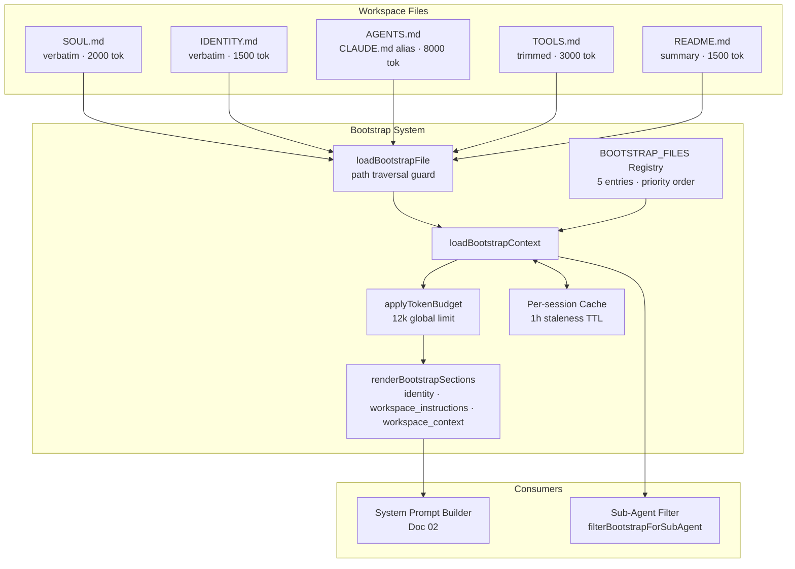
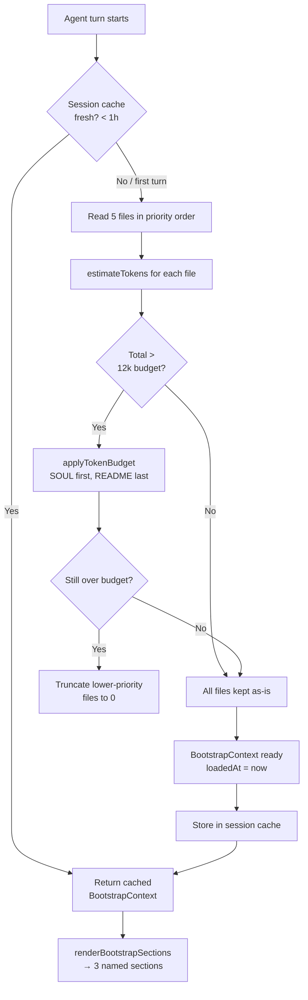
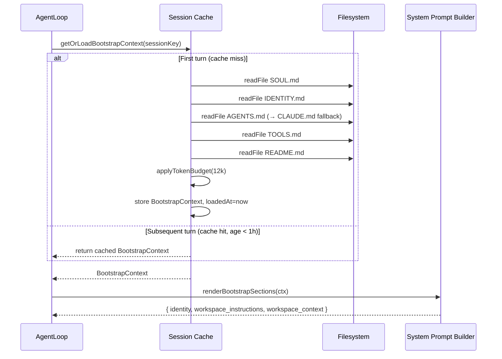
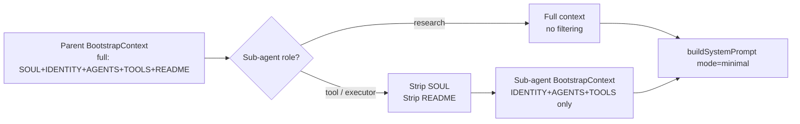

# Design Doc 01: Persona & Identity System

## Overview

The Persona & Identity System gives each agent a stable identity loaded from workspace bootstrap files before any user input is processed. The agent knows *who it is*, *what workspace it belongs to*, and *what its operating constraints are* — all injected into the system prompt before tool calls begin.

## Core Concept

At agent startup, a fixed set of markdown files is read from the workspace directory and injected into the system prompt as high-priority context. These files are:

- `SOUL.md` — personality, values, communication style, behavioral guidelines
- `IDENTITY.md` — role definition, expertise domain, operating constraints
- `AGENTS.md` / `CLAUDE.md` — agent-specific instructions (CLAUDE.md is a symlink alias)
- `TOOLS.md` — environment notes, available external tools, API keys in use
- `README.md` — workspace/project overview (truncated if large)

**Key invariant**: Bootstrap files are loaded once per session start (not per turn), cached in-session, and never re-read mid-conversation. This prevents identity drift.

---

## Data Model

```typescript
// Bootstrap file descriptor
interface BootstrapFile {
  name: string;           // logical name: "SOUL", "IDENTITY", "AGENTS", "TOOLS", "README"
  filename: string;       // actual filename on disk
  aliases?: string[];     // alternate filenames checked in order
  required: boolean;      // if false, skip silently when missing
  maxTokens: number;      // hard truncation limit
  section: PromptSection; // which system prompt section to inject into
  mode: BootstrapContextMode;
}

type BootstrapContextMode =
  | "verbatim"     // inject as-is (SOUL, IDENTITY)
  | "trimmed"      // whitespace-normalize, strip trailing blank lines (AGENTS, TOOLS)
  | "summary"      // truncate to maxTokens with tail-truncation (README)
  | "excluded";    // never inject (e.g., large binary-adjacent files)

// Loaded result
interface BootstrapContext {
  agentId: string;
  workspaceDir: string;
  files: Map<string, BootstrapFileResult>;
  loadedAt: number;        // epoch ms — for cache invalidation
  totalTokenEstimate: number;
}

interface BootstrapFileResult {
  name: string;
  content: string;         // possibly truncated
  rawBytes: number;
  truncated: boolean;
  missing: boolean;        // true if file not found (and not required)
}
```

---

## Bootstrap File Registry

```typescript
const BOOTSTRAP_FILES: BootstrapFile[] = [
  {
    name: "SOUL",
    filename: "SOUL.md",
    required: false,
    maxTokens: 2000,
    section: "identity",
    mode: "verbatim",
  },
  {
    name: "IDENTITY",
    filename: "IDENTITY.md",
    required: false,
    maxTokens: 1500,
    section: "identity",
    mode: "verbatim",
  },
  {
    name: "AGENTS",
    filename: "AGENTS.md",
    aliases: ["CLAUDE.md"],  // try AGENTS.md first, fallback to CLAUDE.md
    required: false,
    maxTokens: 8000,
    section: "workspace_instructions",
    mode: "trimmed",
  },
  {
    name: "TOOLS",
    filename: "TOOLS.md",
    required: false,
    maxTokens: 3000,
    section: "workspace_instructions",
    mode: "trimmed",
  },
  {
    name: "README",
    filename: "README.md",
    required: false,
    maxTokens: 1500,
    section: "workspace_context",
    mode: "summary",
  },
];
```

---

## Load Algorithm

```typescript
async function loadBootstrapContext(params: {
  agentId: string;
  workspaceDir: string;
  cfg: AgentConfig;
}): Promise<BootstrapContext> {
  const { agentId, workspaceDir, cfg } = params;
  const files = new Map<string, BootstrapFileResult>();
  let totalTokenEstimate = 0;

  for (const spec of BOOTSTRAP_FILES) {
    const result = await loadBootstrapFile({ spec, workspaceDir, cfg });
    files.set(spec.name, result);
    totalTokenEstimate += estimateTokens(result.content);
  }

  // Token budget enforcement: identity gets priority
  // If total exceeds budget, truncate lower-priority sections
  const budget = cfg.bootstrapTokenBudget ?? 12000;
  if (totalTokenEstimate > budget) {
    applyTokenBudget(files, budget);
  }

  return {
    agentId,
    workspaceDir,
    files,
    loadedAt: Date.now(),
    totalTokenEstimate,
  };
}

async function loadBootstrapFile(params: {
  spec: BootstrapFile;
  workspaceDir: string;
  cfg: AgentConfig;
}): Promise<BootstrapFileResult> {
  const { spec, workspaceDir } = params;

  // Resolve filename: try primary, then aliases
  const candidates = [spec.filename, ...(spec.aliases ?? [])];
  let resolvedPath: string | null = null;

  for (const candidate of candidates) {
    const p = path.join(workspaceDir, candidate);
    // SECURITY: ensure file is inside workspaceDir (path traversal guard)
    if (!isPathInside(workspaceDir, p)) continue;
    if (fs.existsSync(p)) {
      resolvedPath = p;
      break;
    }
  }

  if (!resolvedPath) {
    return { name: spec.name, content: "", rawBytes: 0, truncated: false, missing: true };
  }

  const raw = await fs.promises.readFile(resolvedPath, "utf8");
  const rawBytes = Buffer.byteLength(raw, "utf8");

  let content = raw;
  let truncated = false;

  // Apply context mode
  if (spec.mode === "trimmed") {
    content = raw.trimEnd();
  } else if (spec.mode === "summary") {
    // Tail-truncate: keep head content (most important in README)
    const tokenEstimate = estimateTokens(raw);
    if (tokenEstimate > spec.maxTokens) {
      content = truncateToTokens(raw, spec.maxTokens);
      truncated = true;
    }
  }

  // Final token-limit enforcement per file
  if (estimateTokens(content) > spec.maxTokens) {
    content = truncateToTokens(content, spec.maxTokens);
    truncated = true;
  }

  return { name: spec.name, content, rawBytes, truncated, missing: false };
}

function applyTokenBudget(
  files: Map<string, BootstrapFileResult>,
  budget: number,
): void {
  // Priority order: SOUL > IDENTITY > AGENTS > TOOLS > README
  const priority = ["SOUL", "IDENTITY", "AGENTS", "TOOLS", "README"];
  let remaining = budget;

  for (const name of priority) {
    const file = files.get(name);
    if (!file || file.missing) continue;
    const tokens = estimateTokens(file.content);
    if (tokens <= remaining) {
      remaining -= tokens;
    } else {
      // Truncate this file to remaining budget
      file.content = truncateToTokens(file.content, remaining);
      file.truncated = true;
      remaining = 0;
    }
  }

  // Zero out anything past budget
  if (remaining === 0) {
    for (const [name, file] of files) {
      if (!priority.includes(name) && !file.missing) {
        file.content = "";
        file.truncated = true;
      }
    }
  }
}
```

---

## System Prompt Injection

Bootstrap content is injected into the system prompt in a deterministic order. The system prompt builder (Doc 02) calls `renderBootstrapSections()`:

```typescript
function renderBootstrapSections(ctx: BootstrapContext): Record<string, string> {
  const sections: Record<string, string> = {};

  // Identity block: SOUL + IDENTITY merged under one section
  const identityParts: string[] = [];
  for (const name of ["SOUL", "IDENTITY"]) {
    const f = ctx.files.get(name);
    if (f && !f.missing && f.content) {
      identityParts.push(`## ${name}\n\n${f.content}`);
    }
  }
  if (identityParts.length > 0) {
    sections["identity"] = identityParts.join("\n\n---\n\n");
  }

  // Workspace instructions block: AGENTS + TOOLS
  const instrParts: string[] = [];
  for (const name of ["AGENTS", "TOOLS"]) {
    const f = ctx.files.get(name);
    if (f && !f.missing && f.content) {
      instrParts.push(`## ${name}\n\n${f.content}`);
    }
  }
  if (instrParts.length > 0) {
    sections["workspace_instructions"] = instrParts.join("\n\n---\n\n");
  }

  // Workspace context block: README
  const readme = ctx.files.get("README");
  if (readme && !readme.missing && readme.content) {
    sections["workspace_context"] = readme.content;
  }

  return sections;
}
```

---

## Per-Session Cache

The bootstrap context is loaded once per session, stored in the session entry, and reused on subsequent turns:

```typescript
interface SessionEntry {
  // ... other fields ...
  bootstrapContext?: BootstrapContext;
  bootstrapLoadedAt?: number;
}

async function getOrLoadBootstrapContext(params: {
  session: SessionEntry;
  agentId: string;
  workspaceDir: string;
  cfg: AgentConfig;
  forceReload?: boolean;
}): Promise<BootstrapContext> {
  const { session, forceReload } = params;

  // Use cached version unless forced or stale (>1 hour)
  const maxAge = 60 * 60 * 1000; // 1 hour
  const isStale = !session.bootstrapContext ||
    (Date.now() - (session.bootstrapLoadedAt ?? 0)) > maxAge;

  if (!forceReload && !isStale && session.bootstrapContext) {
    return session.bootstrapContext;
  }

  const ctx = await loadBootstrapContext({
    agentId: params.agentId,
    workspaceDir: params.workspaceDir,
    cfg: params.cfg,
  });

  session.bootstrapContext = ctx;
  session.bootstrapLoadedAt = ctx.loadedAt;
  return ctx;
}
```

---

## Sub-Agent Bootstrap Filtering

When spawning sub-agents (see Doc 07), the bootstrap context is filtered to prevent identity bleed:

```typescript
function filterBootstrapForSubAgent(
  ctx: BootstrapContext,
  subAgentRole: "tool" | "research" | "executor",
): BootstrapContext {
  const filtered = new Map(ctx.files);

  // Tool sub-agents don't get SOUL (personality) — they're execution units
  if (subAgentRole === "tool" || subAgentRole === "executor") {
    const soul = filtered.get("SOUL");
    if (soul) filtered.set("SOUL", { ...soul, content: "", truncated: true });
  }

  // Research sub-agents get full context
  // Tool/executor sub-agents get AGENTS + TOOLS only (workspace instructions)
  if (subAgentRole !== "research") {
    const readme = filtered.get("README");
    if (readme) filtered.set("README", { ...readme, content: "", truncated: true });
  }

  return { ...ctx, files: filtered };
}
```

---

## Placeholder Detection

Bootstrap files may contain placeholder values from templates. These are detected and warned about but not blocked:

```typescript
const PLACEHOLDER_PATTERNS = [
  /\{\{[^}]+\}\}/,          // Handlebars: {{YOUR_NAME}}
  /\[YOUR_[A-Z_]+\]/,       // Bracket: [YOUR_ROLE]
  /<[A-Z_]+_HERE>/,          // Angle: <INSERT_NAME_HERE>
  /TODO:?\s+fill/i,          // TODO: fill in
];

function detectPlaceholders(content: string): string[] {
  const found: string[] = [];
  for (const pattern of PLACEHOLDER_PATTERNS) {
    const match = content.match(pattern);
    if (match) found.push(match[0]);
  }
  return found;
}
```

---

## Security: Path Traversal Guard

All file reads must be inside `workspaceDir`:

```typescript
function isPathInside(parent: string, child: string): boolean {
  const realParent = fs.realpathSync(parent);
  let realChild: string;
  try {
    realChild = fs.realpathSync(child);
  } catch {
    // File doesn't exist yet — check non-resolved path
    realChild = path.resolve(child);
  }
  return realChild.startsWith(realParent + path.sep) || realChild === realParent;
}
```

---

## Diagrams

### Architecture: Bootstrap System Components



### Flow: Bootstrap Load & Token Budget



### Sequence: First Turn vs Subsequent Turn



### Flow: Sub-Agent Bootstrap Filtering



## Implementation Checklist

- [ ] `BootstrapFile` registry with 5 entries (SOUL, IDENTITY, AGENTS, TOOLS, README)
- [ ] `loadBootstrapContext()` reads files in priority order
- [ ] Alias resolution (AGENTS.md → CLAUDE.md fallback)
- [ ] Per-file `maxTokens` enforcement via `truncateToTokens()`
- [ ] Global token budget (12k default) with priority-order trimming
- [ ] Path traversal guard on every file read
- [ ] `renderBootstrapSections()` returns named sections for system prompt builder
- [ ] Per-session cache with 1-hour staleness check
- [ ] Sub-agent filtering for `tool`/`executor` role (strip SOUL, README)
- [ ] Placeholder detection (warn, don't block)
- [ ] `missing: true` for absent non-required files (no error thrown)
- [ ] `BootstrapContext.loadedAt` for cache age tracking
