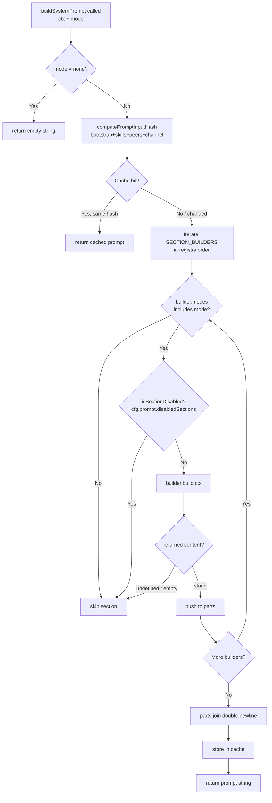
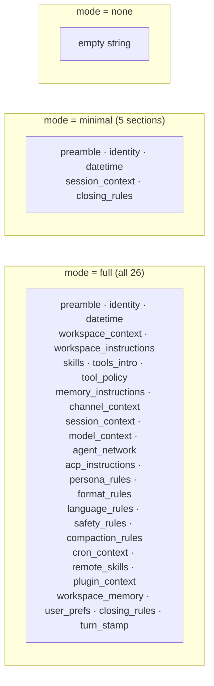

# Design Doc 02: 26-Section System Prompt Builder

## Overview

The system prompt is assembled from up to 26 named sections in a deterministic fixed order. Each section is produced by a pure builder function; the builder picks which sections to include based on a `PromptMode` and per-section inclusion flags. The final output is a single string passed to the LLM as the `system` parameter.

## Core Concept

No section is hardcoded as a raw string in a single giant template. Instead, each section is independently composable and can be included, excluded, or overridden without touching other sections. This makes it easy to create stripped-down system prompts for sub-agents, heartbeat turns, or tool-only calls.

---

## Prompt Modes

```typescript
type PromptMode =
  | "full"      // all applicable sections included (main agent, first turn)
  | "minimal"   // identity + tools only (sub-agents, heartbeat)
  | "none";     // empty system prompt (raw API passthrough)
```

---

## Section Registry (26 sections in fixed order)

```typescript
type SectionName =
  | "preamble"              // 01: "You are <name>, an AI assistant..."
  | "identity"              // 02: SOUL.md + IDENTITY.md content
  | "datetime"              // 03: current date/time in agent's timezone
  | "workspace_context"     // 04: README.md summary
  | "workspace_instructions"// 05: AGENTS.md + TOOLS.md content
  | "skills"                // 06: available slash-command skills (XML block)
  | "tools_intro"           // 07: brief note on available tools
  | "tool_policy"           // 08: policy constraints (depth limits, gating)
  | "memory_instructions"   // 09: how/when to use memory tools
  | "channel_context"       // 10: which channel this turn arrives on
  | "session_context"       // 11: session ID, turn number, compaction count
  | "model_context"         // 12: current model name, thinking mode
  | "agent_network"         // 13: known peer agents and their roles
  | "acp_instructions"      // 14: inter-agent communication protocol rules
  | "persona_rules"         // 15: behavioral rules derived from SOUL
  | "format_rules"          // 16: output formatting preferences
  | "language_rules"        // 17: language/locale constraints
  | "safety_rules"          // 18: content policy, refusal guidance
  | "compaction_rules"      // 19: instructions for context compaction
  | "cron_context"          // 20: scheduled task context (cron/heartbeat turns)
  | "remote_skills"         // 21: remote skill endpoints available
  | "plugin_context"        // 22: active plugin names and capabilities
  | "workspace_memory"      // 23: injected memory excerpts (top-K recalled)
  | "user_prefs"            // 24: user preference notes
  | "closing_rules"         // 25: final behavioral reminder
  | "turn_stamp";           // 26: per-turn hash for tracing (debug only)
```

---

## Section Builder Interface

```typescript
interface SectionBuilder {
  name: SectionName;
  modes: PromptMode[];   // which PromptModes include this section
  build(ctx: PromptBuildContext): string | undefined;
  // Returns undefined to skip the section dynamically
}

interface PromptBuildContext {
  agentId: string;
  agentName: string;
  workspaceDir: string;
  cfg: AgentConfig;
  session: SessionEntry;
  bootstrapCtx: BootstrapContext;
  channelId?: string;
  channelType?: string;
  turnNumber: number;
  compactionCount: number;
  memoryExcerpts?: string[];
  skillsSnapshot?: SkillsSnapshot;
  plugins?: PluginRecord[];
  peerAgents?: AgentRecord[];
  isHeartbeat?: boolean;
  debugMode?: boolean;
}
```

---

## Section Builders (reference implementations)

```typescript
const SECTION_BUILDERS: SectionBuilder[] = [

  {
    name: "preamble",
    modes: ["full", "minimal"],
    build(ctx) {
      return `You are ${ctx.agentName}, an AI assistant running in the OpenClaw agent framework.`;
    },
  },

  {
    name: "identity",
    modes: ["full", "minimal"],
    build(ctx) {
      return ctx.bootstrapCtx
        ? renderBootstrapSections(ctx.bootstrapCtx)["identity"]
        : undefined;
    },
  },

  {
    name: "datetime",
    modes: ["full", "minimal"],
    build(ctx) {
      const tz = resolveAgentTimezone(ctx.cfg);
      const now = formatZonedTimestamp(new Date(), { timeZone: tz });
      return `Current date/time: ${now} (${tz})`;
    },
  },

  {
    name: "workspace_context",
    modes: ["full"],
    build(ctx) {
      return ctx.bootstrapCtx
        ? renderBootstrapSections(ctx.bootstrapCtx)["workspace_context"]
        : undefined;
    },
  },

  {
    name: "workspace_instructions",
    modes: ["full"],
    build(ctx) {
      return ctx.bootstrapCtx
        ? renderBootstrapSections(ctx.bootstrapCtx)["workspace_instructions"]
        : undefined;
    },
  },

  {
    name: "skills",
    modes: ["full"],
    build(ctx) {
      if (!ctx.skillsSnapshot?.skills?.length) return undefined;
      return renderSkillsXml(ctx.skillsSnapshot.skills);
    },
  },

  {
    name: "channel_context",
    modes: ["full"],
    build(ctx) {
      if (!ctx.channelId) return undefined;
      return `Current channel: ${ctx.channelType ?? "unknown"} (id: ${ctx.channelId})`;
    },
  },

  {
    name: "session_context",
    modes: ["full", "minimal"],
    build(ctx) {
      const lines = [
        `Session ID: ${ctx.session.sessionId ?? "unknown"}`,
        `Turn: ${ctx.turnNumber}`,
      ];
      if (ctx.compactionCount > 0) {
        lines.push(`Compactions: ${ctx.compactionCount}`);
      }
      return lines.join("\n");
    },
  },

  {
    name: "memory_instructions",
    modes: ["full"],
    build(ctx) {
      if (!hasMemoryPlugin(ctx.plugins)) return undefined;
      return [
        "You have access to a persistent memory store.",
        "Use memory_search to recall relevant past context before responding.",
        "Use memory_store to save important facts, preferences, and decisions.",
        "Use memory_forget to remove outdated or incorrect memories.",
      ].join("\n");
    },
  },

  {
    name: "workspace_memory",
    modes: ["full"],
    build(ctx) {
      if (!ctx.memoryExcerpts?.length) return undefined;
      const header = "## Recalled Memory\n";
      return header + ctx.memoryExcerpts.map((e) => `- ${e}`).join("\n");
    },
  },

  {
    name: "agent_network",
    modes: ["full"],
    build(ctx) {
      if (!ctx.peerAgents?.length) return undefined;
      const lines = ["## Peer Agents"];
      for (const agent of ctx.peerAgents) {
        lines.push(`- ${agent.name} (${agent.agentId}): ${agent.role}`);
      }
      return lines.join("\n");
    },
  },

  {
    name: "cron_context",
    modes: ["full"],
    build(ctx) {
      if (!ctx.isHeartbeat) return undefined;
      return "This is an automated heartbeat turn. Perform scheduled maintenance tasks only.";
    },
  },

  {
    name: "closing_rules",
    modes: ["full", "minimal"],
    build(_ctx) {
      return "Always be helpful, accurate, and concise. If unsure, say so.";
    },
  },

  {
    name: "turn_stamp",
    modes: ["full"],
    build(ctx) {
      if (!ctx.debugMode) return undefined;
      const hash = crypto
        .createHash("sha1")
        .update(`${ctx.session.sessionId}:${ctx.turnNumber}`)
        .digest("hex")
        .slice(0, 8);
      return `[turn:${hash}]`;
    },
  },

  // ... remaining sections follow the same pattern
];
```

---

## Assembly Pipeline

```typescript
function buildSystemPrompt(
  ctx: PromptBuildContext,
  mode: PromptMode = "full",
): string {
  if (mode === "none") return "";

  const parts: string[] = [];

  for (const builder of SECTION_BUILDERS) {
    // Skip sections not applicable to this mode
    if (!builder.modes.includes(mode)) continue;

    // Skip sections disabled by config
    if (isSectionDisabled(builder.name, ctx.cfg)) continue;

    let content: string | undefined;
    try {
      content = builder.build(ctx);
    } catch (err) {
      // Section builder failures are non-fatal — skip and log
      log.warn(`system prompt section '${builder.name}' failed: ${err}`);
      content = undefined;
    }

    if (content && content.trim()) {
      parts.push(content.trim());
    }
  }

  return parts.join("\n\n");
}

function isSectionDisabled(name: SectionName, cfg: AgentConfig): boolean {
  return cfg.prompt?.disabledSections?.includes(name) ?? false;
}
```

---

## Hash-Based Cache Invalidation

The system prompt is expensive to rebuild on every turn. Cache by hashing the inputs:

```typescript
interface PromptCache {
  inputHash: string;
  prompt: string;
  builtAt: number;
}

function computePromptInputHash(ctx: PromptBuildContext): string {
  const key = JSON.stringify({
    agentId: ctx.agentId,
    // Bootstrap file content hashes (not full content)
    bootstrapHashes: [...(ctx.bootstrapCtx?.files.entries() ?? [])].map(
      ([k, v]) => [k, hash4(v.content)],
    ),
    skillsVersion: ctx.skillsSnapshot?.version ?? 0,
    pluginIds: ctx.plugins?.map((p) => p.id).sort(),
    peerAgentIds: ctx.peerAgents?.map((a) => a.agentId).sort(),
    channelId: ctx.channelId,
    isHeartbeat: ctx.isHeartbeat,
    // Turn-specific fields that change each turn
    turnNumber: ctx.turnNumber,
    compactionCount: ctx.compactionCount,
  });
  return hash4(key);
}

function hash4(s: string): string {
  return crypto.createHash("sha1").update(s).digest("hex").slice(0, 8);
}
```

In practice, turn-specific sections (datetime, session_context, turn_stamp) change every turn. The cache primarily helps when: skills haven't changed, no new peers, and only turn metadata updates. For those sections, the builder is fast enough that caching is optional — the value is in the bootstrap/skills sections.

---

## Minimal Mode Example (sub-agent)

When spawning a tool sub-agent, pass `mode: "minimal"`:

```typescript
const subAgentPrompt = buildSystemPrompt(
  {
    ...ctx,
    bootstrapCtx: filterBootstrapForSubAgent(ctx.bootstrapCtx, "tool"),
    skillsSnapshot: undefined,   // sub-agents don't get slash commands
    peerAgents: [],              // no peer routing
    memoryExcerpts: [],          // no memory injection
  },
  "minimal",
);
// Result includes only: preamble, identity, datetime, session_context, closing_rules
```

---

## Config Overrides

```yaml
# openclaw.json / agent config
agents:
  defaults:
    prompt:
      mode: full               # full | minimal | none
      disabledSections:
        - agent_network        # remove if single-agent deployment
        - acp_instructions     # remove if ACP not used
      customSections:
        - name: custom_intro
          content: "You work for Acme Corp. Always refer to users as 'colleague'."
          after: identity      # insert after the identity section
```

---

## Diagrams

### Architecture: 26-Section System Prompt Pipeline

```mermaid
graph TB
    subgraph "Inputs"
        BC[BootstrapContext\nSOUL·IDENTITY·AGENTS·TOOLS·README]
        SS[SkillsSnapshot\nversion + skills list]
        PE[PeerAgents\nagent registry]
        ME[MemoryExcerpts\ntop-K recalled]
        SC[SessionContext\nID·turn·compactions]
    end

    subgraph "Section Builders (26 — fixed order)"
        direction LR
        S01[01 preamble]
        S02[02 identity]
        S03[03 datetime]
        S04[04 workspace_context]
        S05[05 workspace_instructions]
        S06[06 skills]
        S07[07 tools_intro]
        S08[08 tool_policy]
        S09[09 memory_instructions]
        S10[10 channel_context]
        S11[11 session_context]
        S12[12 model_context]
        S13[13 agent_network]
        S14[14 acp_instructions]
        S15[15 persona_rules]
        S16[16 format_rules]
        S17[17 language_rules]
        S18[18 safety_rules]
        S19[19 compaction_rules]
        S20[20 cron_context]
        S21[21 remote_skills]
        S22[22 plugin_context]
        S23[23 workspace_memory]
        S24[24 user_prefs]
        S25[25 closing_rules]
        S26[26 turn_stamp]
    end

    subgraph "Assembly"
        PM{PromptMode\nfull · minimal · none}
        CACHE[Hash-based Cache\nper-session]
        OUT[Final system string\nparagraphs joined]
    end

    BC --> S02 & S04 & S05
    SS --> S06
    PE --> S13
    ME --> S23
    SC --> S11

    S01 --> PM
    S02 --> PM
    S03 --> PM
    S06 --> PM
    S11 --> PM
    S13 --> PM
    S25 --> PM
    PM --> CACHE --> OUT
```



### Flow: buildSystemPrompt Execution



### Component: Mode vs Sections Included



### Sequence: System Prompt Cache Lifecycle

```mermaid
sequenceDiagram
    participant Loop as Agent Loop
    participant SPB as Prompt Builder
    participant Cache as PromptCache
    participant Builders as SectionBuilders

    Loop->>SPB: buildSystemPrompt(ctx, "full")
    SPB->>SPB: computePromptInputHash(ctx)
    SPB->>Cache: lookup(hash)
    alt cache miss
        Cache-->>SPB: null
        loop for each of 26 SectionBuilders
            SPB->>Builders: builder.build(ctx)
            Builders-->>SPB: string | undefined
        end
        SPB->>SPB: join non-empty parts
        SPB->>Cache: store(hash, prompt)
    else cache hit
        Cache-->>SPB: cached prompt string
    end
    SPB-->>Loop: system prompt string
```

## Implementation Checklist

- [ ] `SectionName` type with all 26 names in fixed order
- [ ] `SectionBuilder` interface with `modes` + `build(ctx)` returning `string | undefined`
- [ ] `PromptBuildContext` struct carrying all needed inputs
- [ ] 26 `SectionBuilder` implementations (pure functions, no side effects)
- [ ] `buildSystemPrompt(ctx, mode)` iterates builders in registry order
- [ ] `PromptMode` enum: `full`, `minimal`, `none`
- [ ] `isSectionDisabled()` reads `cfg.prompt.disabledSections`
- [ ] Section builder exceptions are caught and logged (non-fatal)
- [ ] `computePromptInputHash()` for cache invalidation
- [ ] `PromptCache` per-session with hash comparison
- [ ] Minimal mode example tested: only 5 sections emitted
- [ ] Config `customSections` with `after:` insertion point
