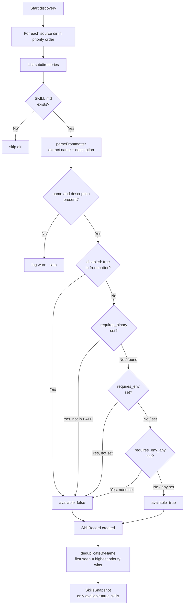
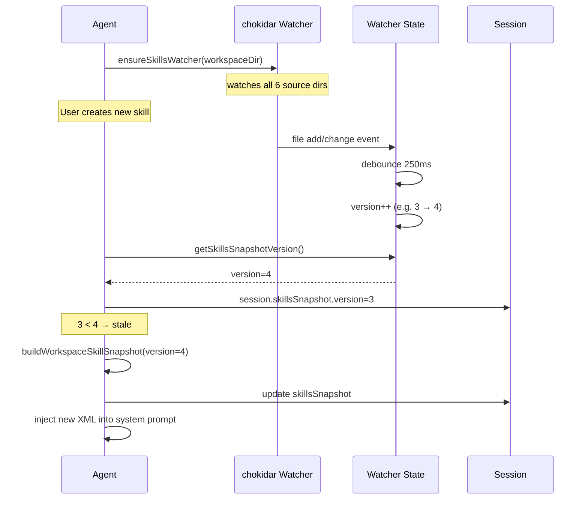
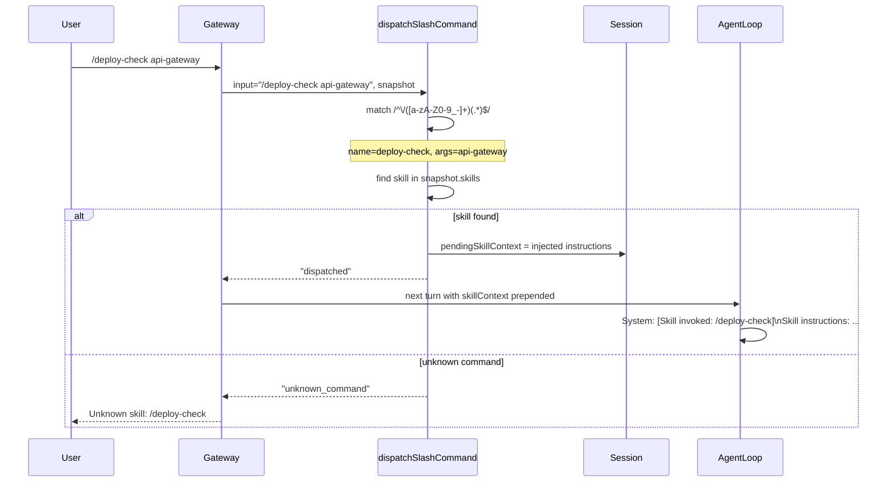
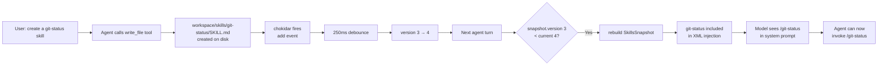

# Design Doc 04: Skills System

## Overview

Skills are user-defined slash commands that the agent can invoke directly. Each skill lives in a directory containing a `SKILL.md` file. The system reads all skill directories at startup, filters them by availability (binary presence, environment variables), injects them as XML into the system prompt, and watches for file changes via a filesystem watcher (hot reload). Agents can create new skills by writing `SKILL.md` files to the workspace — they are auto-loaded on next turn.

## Core Concept

Skills are **not tools**. A tool is a function the LLM calls programmatically via `tool_use`. A skill is a slash command — a pre-written prompt template that a user (or the agent itself) invokes with `/skill-name [args]`. The skill's content is injected into the system prompt so the model knows the command exists and what it does.

---

## SKILL.md Format

```markdown
---
name: deploy-check
description: Check deployment status for a service
requires_binary: kubectl
requires_env: KUBECONFIG
tags: [devops, kubernetes]
---

## Usage

/deploy-check [service-name]

## Instructions

When invoked, check the rollout status of the named Kubernetes service:
1. Run `kubectl rollout status deployment/<service-name>`
2. Report current replica counts and any failing pods
3. If unhealthy, suggest remediation steps

## Examples

/deploy-check api-gateway
/deploy-check worker
```

### Frontmatter Schema

```typescript
interface SkillFrontmatter {
  name: string;              // slash-command trigger: /name
  description: string;       // shown in system prompt and /help
  requires_binary?: string;  // skill hidden unless this binary is in PATH
  requires_env?: string;     // skill hidden unless this env var is set
  requires_env_any?: string[]; // skill shown if ANY of these env vars are set
  tags?: string[];           // grouping metadata
  min_depth?: number;        // only available at sub-agent depth >= N
  channel_only?: string[];   // only inject on these channel types
  disabled?: boolean;        // explicitly disabled
}
```

---

## Skill Source Locations (6 sources, in priority order)

```typescript
const SKILL_SOURCE_DIRS = [
  // 1. Agent-specific skills (highest priority, agent-local)
  path.join(workspaceDir, `.openclaw/agents/${agentId}/skills`),
  // 2. Workspace skills (shared across agents in this workspace)
  path.join(workspaceDir, ".openclaw/skills"),
  // 3. Legacy workspace location
  path.join(workspaceDir, "workspace/skills"),
  // 4. Plugin-contributed skill dirs (from plugin manifests)
  ...resolvePluginSkillDirs({ workspaceDir, config: cfg }),
  // 5. Global user skills (~/.openclaw/skills)
  path.join(os.homedir(), ".openclaw/skills"),
  // 6. Built-in framework skills (shipped with the framework)
  path.join(frameworkDir, "skills"),
];
```

Skills with the same `name` in a higher-priority source override lower-priority ones.

---

## Skill Discovery

```typescript
interface SkillRecord {
  name: string;
  description: string;
  content: string;           // full SKILL.md content after frontmatter
  frontmatter: SkillFrontmatter;
  sourceDir: string;
  filePath: string;
  available: boolean;        // gating result
  unavailableReason?: string; // if !available, why
}

interface SkillsSnapshot {
  version: number;           // bumped on every reload
  skills: SkillRecord[];     // only available skills
  loadedAt: number;
}

function buildWorkspaceSkillSnapshot(
  workspaceDir: string,
  params: {
    config: AgentConfig;
    agentId: string;
    skillFilter?: string[];  // if set, only include skills with these names
    snapshotVersion: number;
  },
): SkillsSnapshot {
  const allSkills = discoverAllSkills(workspaceDir, params.config, params.agentId);
  const deduped = deduplicateByName(allSkills);
  const filtered = params.skillFilter
    ? deduped.filter((s) => params.skillFilter!.includes(s.name))
    : deduped;
  const available = filtered.filter((s) => s.available);

  return {
    version: params.snapshotVersion,
    skills: available,
    loadedAt: Date.now(),
  };
}

function discoverAllSkills(
  workspaceDir: string,
  cfg: AgentConfig,
  agentId: string,
): SkillRecord[] {
  const skills: SkillRecord[] = [];

  for (const sourceDir of resolveSkillSourceDirs(workspaceDir, cfg, agentId)) {
    if (!fs.existsSync(sourceDir)) continue;

    const entries = fs.readdirSync(sourceDir, { withFileTypes: true });
    for (const entry of entries) {
      if (!entry.isDirectory()) continue;
      const skillDir = path.join(sourceDir, entry.name);
      const skillFile = path.join(skillDir, "SKILL.md");
      if (!fs.existsSync(skillFile)) continue;

      const skill = loadSkillFromFile(skillFile, sourceDir);
      if (skill) skills.push(skill);
    }
  }

  return skills;
}

function loadSkillFromFile(filePath: string, sourceDir: string): SkillRecord | null {
  const raw = fs.readFileSync(filePath, "utf8");
  const { frontmatter, body } = parseFrontmatter(raw);

  if (!frontmatter.name || !frontmatter.description) {
    log.warn(`SKILL.md missing name or description: ${filePath}`);
    return null;
  }

  const gating = checkSkillGating(frontmatter);

  return {
    name: frontmatter.name,
    description: frontmatter.description,
    content: body,
    frontmatter,
    sourceDir,
    filePath,
    available: gating.available,
    unavailableReason: gating.reason,
  };
}
```

---

## Load-Time Gating

```typescript
interface GatingResult {
  available: boolean;
  reason?: string;
}

function checkSkillGating(fm: SkillFrontmatter): GatingResult {
  if (fm.disabled) {
    return { available: false, reason: "disabled in frontmatter" };
  }

  if (fm.requires_binary) {
    if (!isBinaryInPath(fm.requires_binary)) {
      return {
        available: false,
        reason: `requires binary '${fm.requires_binary}' not found in PATH`,
      };
    }
  }

  if (fm.requires_env) {
    if (!process.env[fm.requires_env]) {
      return {
        available: false,
        reason: `requires env var '${fm.requires_env}' not set`,
      };
    }
  }

  if (fm.requires_env_any) {
    const anySet = fm.requires_env_any.some((v) => Boolean(process.env[v]));
    if (!anySet) {
      return {
        available: false,
        reason: `requires one of env vars: ${fm.requires_env_any.join(", ")}`,
      };
    }
  }

  return { available: true };
}

function isBinaryInPath(binary: string): boolean {
  try {
    execSync(`which ${binary}`, { stdio: "ignore" });
    return true;
  } catch {
    return false;
  }
}
```

---

## Deduplication

When multiple sources define the same skill name, higher-priority source wins:

```typescript
function deduplicateByName(skills: SkillRecord[]): SkillRecord[] {
  // skills are already in priority order (first = highest priority)
  const seen = new Map<string, SkillRecord>();
  for (const skill of skills) {
    if (!seen.has(skill.name)) {
      seen.set(skill.name, skill);
    }
  }
  return [...seen.values()];
}
```

---

## XML Injection into System Prompt

Skills are injected as an XML block. The model is trained to recognize this format:

```typescript
function renderSkillsXml(skills: SkillRecord[]): string {
  if (skills.length === 0) return "";

  const items = skills
    .map((s) => {
      const lines = [`  <skill name="${escapeXml(s.name)}">`];
      lines.push(`    <description>${escapeXml(s.description)}</description>`);
      if (s.content.trim()) {
        lines.push(`    <instructions>${escapeXml(s.content.trim())}</instructions>`);
      }
      lines.push(`  </skill>`);
      return lines.join("\n");
    })
    .join("\n");

  return [
    "## Available Skills",
    "",
    "You can invoke these slash commands:",
    "",
    "<skills>",
    items,
    "</skills>",
    "",
    "To invoke: type /<name> [arguments] in your response.",
  ].join("\n");
}

function escapeXml(s: string): string {
  return s
    .replace(/&/g, "&amp;")
    .replace(/</g, "&lt;")
    .replace(/>/g, "&gt;")
    .replace(/"/g, "&quot;");
}
```

---

## Hot Reload via Filesystem Watcher

```typescript
interface SkillsWatcherState {
  watcher: FSWatcher;
  version: number;
  debounceTimer?: NodeJS.Timeout;
}

const watchers = new Map<string, SkillsWatcherState>();

function ensureSkillsWatcher(params: {
  workspaceDir: string;
  config: AgentConfig;
}): void {
  if (watchers.has(params.workspaceDir)) return;

  const state: SkillsWatcherState = { version: 1, watcher: null! };

  const watcher = chokidar.watch(
    resolveSkillSourceDirs(params.workspaceDir, params.config, "*"),
    {
      ignoreInitial: true,
      depth: 2,                    // only watch skill dirs, not deep nesting
      persistent: false,
    },
  );

  const bump = () => {
    if (state.debounceTimer) clearTimeout(state.debounceTimer);
    state.debounceTimer = setTimeout(() => {
      state.version += 1;
      log.debug(`skills version bumped to ${state.version} (${params.workspaceDir})`);
    }, 250); // 250ms debounce
  };

  watcher.on("add", bump);
  watcher.on("change", bump);
  watcher.on("unlink", bump);

  state.watcher = watcher;
  watchers.set(params.workspaceDir, state);
}

function getSkillsSnapshotVersion(workspaceDir: string): number {
  return watchers.get(workspaceDir)?.version ?? 0;
}
```

On each turn, the pipeline checks if `session.skillsSnapshot.version < currentVersion`. If stale, it rebuilds the snapshot before constructing the system prompt.

---

## Slash Command Dispatch

When the user sends `/skill-name args`, the gateway intercepts it before forwarding to the agent:

```typescript
async function dispatchSlashCommand(
  input: string,
  snapshot: SkillsSnapshot,
  session: SessionEntry,
): Promise<"dispatched" | "not_a_command" | "unknown_command"> {
  const match = input.match(/^\/([a-zA-Z0-9_-]+)(?:\s+(.*))?$/s);
  if (!match) return "not_a_command";

  const [, commandName, args = ""] = match;
  const skill = snapshot.skills.find((s) => s.name === commandName);

  if (!skill) return "unknown_command";

  // Inject as a special turn: prepend skill instructions to user message
  const injected = [
    `[Skill invoked: /${commandName}]`,
    `Arguments: ${args.trim() || "(none)"}`,
    "",
    "Skill instructions:",
    skill.content,
  ].join("\n");

  session.pendingSkillContext = injected;
  return "dispatched";
}
```

The `pendingSkillContext` is prepended to the next user turn as a System message, giving the model the skill's full instructions before it sees the user's slash command.

---

## Self-Creation Pattern (Agent Creates Own Skills)

An agent can create a new skill by writing a `SKILL.md` file:

```
1. User asks: "Create a skill that checks git status"
2. Agent writes workspace/skills/git-status/SKILL.md
3. chokidar fires → 250ms debounce → version bumps
4. Next turn: snapshotVersion > session.skillsSnapshot.version
5. Snapshot rebuilds → new skill included in system prompt
6. Agent can now use /git-status
```

The agent uses a `write_file` tool to create the skill directory and `SKILL.md`. The gateway's watcher does the rest automatically.

---

## Skill Template for Agent Self-Creation

```typescript
function generateSkillTemplate(params: {
  name: string;
  description: string;
  instructions: string;
  requiresBinary?: string;
  requiresEnv?: string;
}): string {
  const fm: string[] = ["---", `name: ${params.name}`, `description: ${params.description}`];
  if (params.requiresBinary) fm.push(`requires_binary: ${params.requiresBinary}`);
  if (params.requiresEnv) fm.push(`requires_env: ${params.requiresEnv}`);
  fm.push("---");

  return [fm.join("\n"), "", params.instructions].join("\n");
}
```

---

## Diagrams

### Architecture: Skills System Components

```mermaid
graph TB
    subgraph "6 Source Locations (priority order)"
        SRC1[1 · agent-specific\n.openclaw/agents/{agentId}/skills]
        SRC2[2 · workspace shared\n.openclaw/skills]
        SRC3[3 · legacy\nworkspace/skills]
        SRC4[4 · plugin skill dirs\nfrom plugin manifests]
        SRC5[5 · global user\n~/.openclaw/skills]
        SRC6[6 · framework built-ins\nframeworkDir/skills]
    end

    subgraph "Skill Discovery"
        DISC[discoverAllSkills\nscan all dirs for SKILL.md]
        GATE[checkSkillGating\nbinary · env · disabled]
        DEDUP[deduplicateByName\nhigher-priority source wins]
        SNAP[SkillsSnapshot\nversion · skills · loadedAt]
    end

    subgraph "Injection + Dispatch"
        XML[renderSkillsXml\n<skills> XML block]
        SPB[System Prompt\nSection: skills]
        SLASH[dispatchSlashCommand\n/name args → inject context]
    end

    subgraph "Hot Reload"
        WATCH[chokidar watcher\ndepth=2]
        DEBOUNCE[250ms debounce]
        BUMP[version++]
        STALE{session snapshot\nversion < current?}
    end

    SRC1 & SRC2 & SRC3 & SRC4 & SRC5 & SRC6 --> DISC
    DISC --> GATE --> DEDUP --> SNAP
    SNAP --> XML --> SPB
    SNAP --> SLASH
    WATCH --> DEBOUNCE --> BUMP --> STALE
    STALE -->|Yes| DISC
```

### Flow: Skill Discovery & Gating



### Sequence: Hot Reload Lifecycle



### Sequence: Slash Command Dispatch



### Flow: Self-Creation Loop



## Implementation Checklist

- [ ] `SkillFrontmatter` with `name`, `description`, `requires_binary`, `requires_env`, `requires_env_any`, `tags`, `disabled`
- [ ] `SkillRecord` with `available`, `unavailableReason`, `filePath`, `sourceDir`
- [ ] `SkillsSnapshot` with `version`, `skills[]`, `loadedAt`
- [ ] 6 source locations resolved in priority order
- [ ] `discoverAllSkills()` scans all source dirs, loads SKILL.md files
- [ ] `parseFrontmatter()` extracts YAML header + body
- [ ] `checkSkillGating()` checks binary, env var, env-any, disabled flag
- [ ] `deduplicateByName()` keeps highest-priority source
- [ ] `renderSkillsXml()` produces XML block with XML-escaped content
- [ ] `ensureSkillsWatcher()` creates chokidar watcher with 250ms debounce
- [ ] `getSkillsSnapshotVersion()` returns current version for staleness check
- [ ] Per-turn version check: rebuild snapshot if stale
- [ ] `dispatchSlashCommand()` parses `/name args`, injects skill context
- [ ] `generateSkillTemplate()` helper for agent self-creation
- [ ] Plugin skill dirs integrated via `resolvePluginSkillDirs()` (source 4)
- [ ] `skillFilter` parameter for per-channel skill filtering
