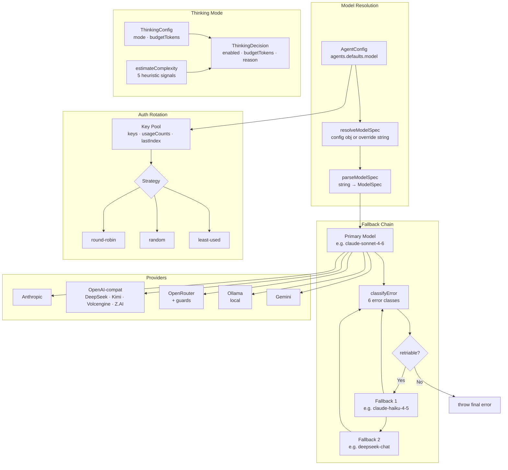
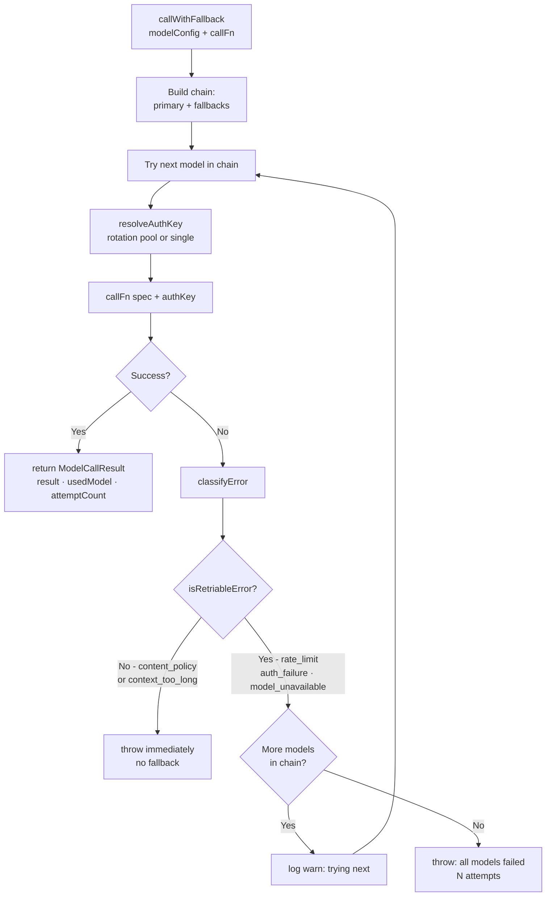
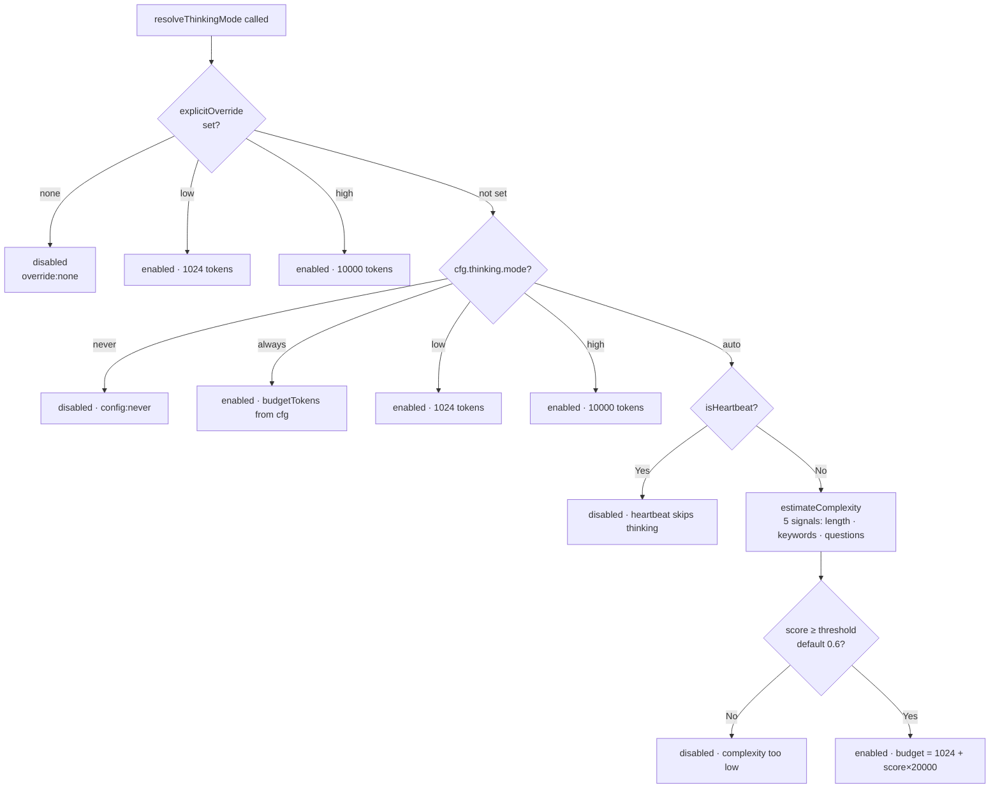
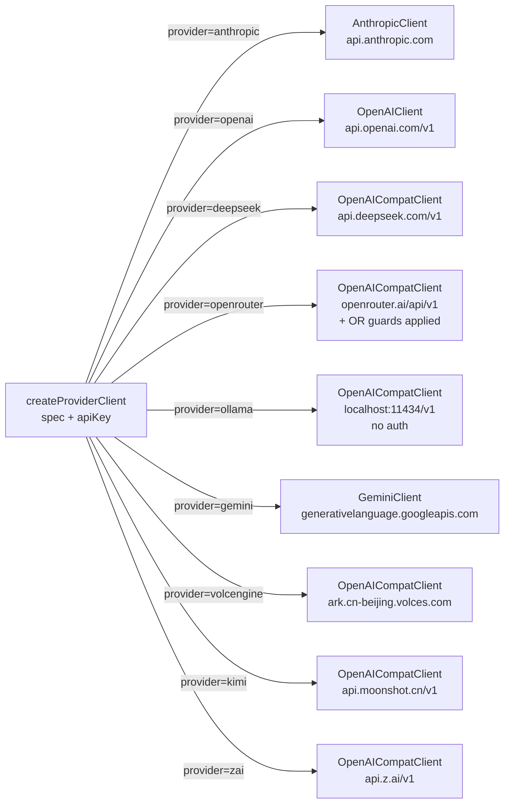
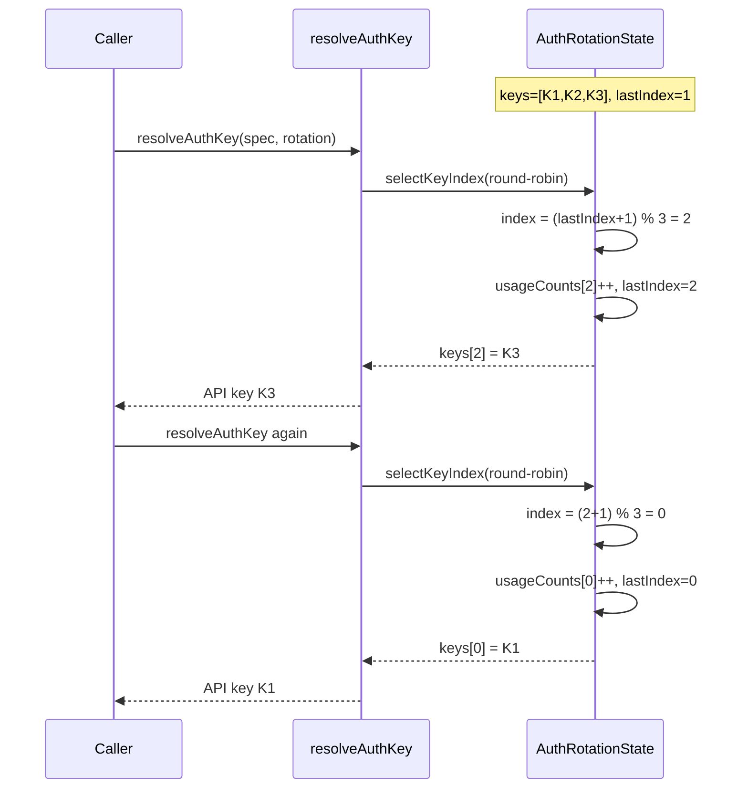

# Design Doc 06: Model Orchestration

## Overview

Model orchestration manages: which model to call, how to authenticate, what to do when a model fails, how to route between providers, and how to control reasoning/thinking modes. It sits between the agent loop and the raw LLM API call. The agent loop never calls a provider directly — it always goes through the orchestrator.

## Core Concept

A single agent config can specify a **primary model** + **fallback chain**. If the primary fails (rate limit, auth error, model unavailable), the orchestrator tries the next in the chain. Auth tokens are rotated from a pool to distribute load. Thinking mode (extended reasoning) is turned on/off per turn based on task complexity heuristics or explicit override.

---

## Data Model

```typescript
interface ModelConfig {
  primary: ModelSpec;
  fallbacks?: ModelSpec[];
  thinking?: ThinkingConfig;
  authRotation?: AuthRotationConfig;
  openRouterGuards?: OpenRouterGuardConfig;
}

interface ModelSpec {
  model: string;                // e.g., "claude-sonnet-4-6", "deepseek/deepseek-chat"
  provider?: string;            // explicit provider key: "anthropic", "deepseek", "openrouter"
  baseUrl?: string;             // override provider base URL
  maxTokens?: number;
  temperature?: number;
  headers?: Record<string, string>; // extra headers (e.g., X-Title for OpenRouter)
}

interface ThinkingConfig {
  mode: "auto" | "always" | "never" | "low" | "high";
  budgetTokens?: number;        // for "low"/"high" modes
  autoThreshold?: number;       // complexity score above which thinking turns on
}

interface AuthRotationConfig {
  keys: string[];               // list of API keys to rotate
  strategy: "round-robin" | "random" | "least-used";
}

interface OpenRouterGuardConfig {
  maxPrice?: number;            // reject models above this $/1M tokens
  allowedProviders?: string[];  // only route to these providers via OpenRouter
  blockedModels?: string[];     // never use these model IDs
}
```

---

## Model Resolution

```typescript
function resolveModelSpec(cfg: AgentConfig, override?: string): ModelSpec {
  const modelCfg = cfg.agents?.defaults?.model;

  if (override) {
    return parseModelSpec(override);
  }

  if (typeof modelCfg === "string") {
    return parseModelSpec(modelCfg);
  }

  if (typeof modelCfg === "object" && modelCfg?.primary) {
    return {
      ...parseModelSpec(modelCfg.primary),
      ...modelCfg, // allow baseUrl, temperature overrides in config object
    };
  }

  // Default fallback
  return { model: "claude-sonnet-4-6", provider: "anthropic" };
}

function parseModelSpec(raw: string): ModelSpec {
  // Formats:
  //   "claude-sonnet-4-6"                  → Anthropic (auto-detect)
  //   "deepseek/deepseek-chat"             → OpenRouter or explicit deepseek
  //   "openrouter:anthropic/claude-3.5"   → OpenRouter explicit
  //   "ollama:llama3"                       → Local Ollama
  if (raw.startsWith("openrouter:")) {
    return { model: raw.slice("openrouter:".length), provider: "openrouter" };
  }
  if (raw.startsWith("ollama:")) {
    return { model: raw.slice("ollama:".length), provider: "ollama" };
  }
  if (raw.includes("/")) {
    // Namespaced model — likely OpenRouter or a named provider
    const [providerHint, ...rest] = raw.split("/");
    return { model: rest.join("/"), provider: providerHint };
  }
  return { model: raw, provider: "anthropic" };
}
```

---

## Fallback Chain

```typescript
interface ModelCallResult<T> {
  result: T;
  usedModel: ModelSpec;
  attemptCount: number;
}

async function callWithFallback<T>(
  modelCfg: ModelConfig,
  callFn: (spec: ModelSpec, authKey: string) => Promise<T>,
  cfg: AgentConfig,
): Promise<ModelCallResult<T>> {
  const chain: ModelSpec[] = [
    modelCfg.primary,
    ...(modelCfg.fallbacks ?? []),
  ];

  let lastError: Error | null = null;
  let attemptCount = 0;

  for (const spec of chain) {
    attemptCount++;
    const authKey = resolveAuthKey(spec, modelCfg.authRotation, cfg);

    try {
      const result = await callFn(spec, authKey);
      return { result, usedModel: spec, attemptCount };
    } catch (err) {
      lastError = err as Error;
      const reason = classifyError(err);

      log.warn(`Model ${spec.model} failed (${reason}), trying next in chain`);

      // Only continue fallback chain for retriable errors
      if (!isRetriableError(reason)) {
        throw err;
      }
    }
  }

  throw new Error(
    `All models in fallback chain failed after ${attemptCount} attempts. Last error: ${lastError?.message}`,
  );
}

type ErrorClass =
  | "rate_limit"       // 429 — retry or fallback
  | "auth_failure"     // 401/403 — try next auth key or fallback
  | "model_unavailable"// 503 / model not found — fallback
  | "context_too_long" // 400 context limit — not retriable
  | "content_policy"   // 400 content blocked — not retriable
  | "network"          // connection error — retry once
  | "unknown";

function classifyError(err: unknown): ErrorClass {
  if (!(err instanceof Error)) return "unknown";
  const msg = err.message.toLowerCase();
  const status = (err as { status?: number }).status;

  if (status === 429 || msg.includes("rate limit")) return "rate_limit";
  if (status === 401 || status === 403) return "auth_failure";
  if (status === 503 || msg.includes("model_not_found")) return "model_unavailable";
  if (msg.includes("context_length") || msg.includes("context window")) return "context_too_long";
  if (msg.includes("content_policy") || msg.includes("safety")) return "content_policy";
  if (msg.includes("econnrefused") || msg.includes("network")) return "network";
  return "unknown";
}

function isRetriableError(cls: ErrorClass): boolean {
  return ["rate_limit", "auth_failure", "model_unavailable", "network"].includes(cls);
}
```

---

## Auth Rotation

```typescript
interface AuthRotationState {
  keys: string[];
  usageCounts: number[];
  lastIndex: number;
}

const rotationState = new Map<string, AuthRotationState>();

function resolveAuthKey(
  spec: ModelSpec,
  rotation: AuthRotationConfig | undefined,
  cfg: AgentConfig,
): string {
  if (!rotation || rotation.keys.length === 0) {
    // Single key from config/env
    return resolveProviderKey(spec.provider ?? "anthropic", cfg);
  }

  const stateKey = `${spec.provider}:${spec.model}`;
  let state = rotationState.get(stateKey);
  if (!state) {
    state = {
      keys: rotation.keys,
      usageCounts: new Array(rotation.keys.length).fill(0),
      lastIndex: -1,
    };
    rotationState.set(stateKey, state);
  }

  const index = selectKeyIndex(state, rotation.strategy);
  state.usageCounts[index]++;
  state.lastIndex = index;
  return state.keys[index];
}

function selectKeyIndex(state: AuthRotationState, strategy: "round-robin" | "random" | "least-used"): number {
  switch (strategy) {
    case "round-robin":
      return (state.lastIndex + 1) % state.keys.length;
    case "random":
      return Math.floor(Math.random() * state.keys.length);
    case "least-used":
      return state.usageCounts.indexOf(Math.min(...state.usageCounts));
  }
}

function resolveProviderKey(provider: string, cfg: AgentConfig): string {
  const providerCfg = cfg.providers?.[provider];
  if (providerCfg?.apiKey) return providerCfg.apiKey;

  const envMap: Record<string, string> = {
    anthropic: "ANTHROPIC_API_KEY",
    openai: "OPENAI_API_KEY",
    deepseek: "DEEPSEEK_API_KEY",
    openrouter: "OPENROUTER_API_KEY",
    gemini: "GEMINI_API_KEY",
    ollama: "",  // no auth needed
  };
  const envKey = envMap[provider];
  if (envKey && process.env[envKey]) return process.env[envKey]!;

  throw new Error(`No API key found for provider '${provider}'`);
}
```

---

## Thinking / Reasoning Mode

```typescript
interface ThinkingDecision {
  enabled: boolean;
  budgetTokens?: number;
  reason: string;
}

function resolveThinkingMode(params: {
  thinkingCfg: ThinkingConfig;
  userMessage: string;
  turnNumber: number;
  isHeartbeat: boolean;
  explicitOverride?: "low" | "high" | "none";
}): ThinkingDecision {
  const { thinkingCfg, explicitOverride } = params;

  // Explicit per-call override
  if (explicitOverride === "none") {
    return { enabled: false, reason: "explicit override: none" };
  }
  if (explicitOverride === "low") {
    return { enabled: true, budgetTokens: 1024, reason: "explicit override: low" };
  }
  if (explicitOverride === "high") {
    return { enabled: true, budgetTokens: 10000, reason: "explicit override: high" };
  }

  // Config-level mode
  switch (thinkingCfg.mode) {
    case "never":
      return { enabled: false, reason: "config: never" };
    case "always":
      return { enabled: true, budgetTokens: thinkingCfg.budgetTokens ?? 5000, reason: "config: always" };
    case "low":
      return { enabled: true, budgetTokens: 1024, reason: "config: low" };
    case "high":
      return { enabled: true, budgetTokens: 10000, reason: "config: high" };
    case "auto": {
      // Heuristic: enable for complex requests
      if (params.isHeartbeat) {
        return { enabled: false, reason: "auto: heartbeat turns skip thinking" };
      }
      const complexity = estimateComplexity(params.userMessage);
      const threshold = thinkingCfg.autoThreshold ?? 0.6;
      if (complexity >= threshold) {
        return {
          enabled: true,
          budgetTokens: Math.round(1024 + (complexity - threshold) * 20000),
          reason: `auto: complexity ${complexity.toFixed(2)} >= ${threshold}`,
        };
      }
      return { enabled: false, reason: `auto: complexity ${complexity.toFixed(2)} < ${threshold}` };
    }
  }
}

function estimateComplexity(message: string): number {
  // Simple heuristics — replace with a trained classifier in production
  const signals = [
    message.length > 500,                    // long message
    /\b(analyze|evaluate|compare|design)\b/i.test(message),
    /\b(pros and cons|trade.?off|architecture)\b/i.test(message),
    /\b(implement|refactor|rewrite)\b/i.test(message),
    message.includes("?") && message.split("?").length > 3,  // multiple questions
  ];
  return signals.filter(Boolean).length / signals.length;
}
```

---

## Reasoning Preservation

When a model returns reasoning/thinking tokens, preserve them across compaction:

```typescript
interface MessageWithThinking extends Message {
  thinking?: string;  // <thinking> block content
}

function preserveReasoningInCompaction(
  messages: MessageWithThinking[],
): Message[] {
  // Strip thinking blocks from non-final messages to save tokens
  // Keep final assistant thinking for context continuity
  return messages.map((msg, i) => {
    if (msg.role !== "assistant" || !msg.thinking) return msg;
    if (i === messages.length - 1) return msg; // keep last
    return { ...msg, thinking: undefined }; // strip older ones
  });
}
```

---

## OpenRouter Guards

```typescript
function applyOpenRouterGuards(
  spec: ModelSpec,
  guards: OpenRouterGuardConfig,
): ModelSpec {
  if (spec.provider !== "openrouter") return spec;

  if (guards.blockedModels?.includes(spec.model)) {
    throw new Error(`Model '${spec.model}' is blocked by OpenRouter guard`);
  }

  const headers: Record<string, string> = {
    ...spec.headers,
    "HTTP-Referer": "https://openclaw.ai",
    "X-Title": "OpenClaw",
  };

  if (guards.allowedProviders?.length) {
    // OpenRouter supports provider routing via header
    headers["X-OR-Provider-Allow"] = guards.allowedProviders.join(",");
  }

  return { ...spec, headers };
}
```

---

## Provider Client Factory

```typescript
function createProviderClient(spec: ModelSpec, apiKey: string): LLMClient {
  const baseUrl = spec.baseUrl ?? getDefaultBaseUrl(spec.provider ?? "anthropic");

  switch (spec.provider ?? "anthropic") {
    case "anthropic":
      return new AnthropicClient({ apiKey, baseURL: baseUrl });
    case "openai":
      return new OpenAIClient({ apiKey, baseURL: baseUrl });
    case "deepseek":
    case "openrouter":
    case "volcengine":
    case "kimi":
    case "zai":
      // All OpenAI-compatible
      return new OpenAICompatClient({ apiKey, baseURL: baseUrl });
    case "ollama":
      return new OpenAICompatClient({ apiKey: "ollama", baseURL: baseUrl ?? "http://localhost:11434/v1" });
    case "gemini":
      return new GeminiClient({ apiKey, baseURL: baseUrl });
    default:
      throw new Error(`Unknown provider: ${spec.provider}`);
  }
}

function getDefaultBaseUrl(provider: string): string {
  const urls: Record<string, string> = {
    anthropic: "https://api.anthropic.com",
    openai: "https://api.openai.com/v1",
    deepseek: "https://api.deepseek.com/v1",
    openrouter: "https://openrouter.ai/api/v1",
    ollama: "http://localhost:11434/v1",
    gemini: "https://generativelanguage.googleapis.com/v1beta",
    volcengine: "https://ark.cn-beijing.volces.com/api/v3",
    kimi: "https://api.moonshot.cn/v1",
    zai: "https://api.z.ai/v1",
  };
  return urls[provider] ?? "https://api.anthropic.com";
}
```

---

## Config Example

```yaml
agents:
  defaults:
    model:
      primary: "claude-sonnet-4-6"
      fallbacks:
        - model: "claude-haiku-4-5-20251001"
        - model: "deepseek/deepseek-chat"
          provider: "deepseek"
      thinking:
        mode: auto
        autoThreshold: 0.6
      authRotation:
        keys:
          - "${ANTHROPIC_KEY_1}"
          - "${ANTHROPIC_KEY_2}"
        strategy: least-used
      openRouterGuards:
        maxPrice: 10.0
        allowedProviders: ["anthropic", "openai"]
```

---

## Diagrams

### Architecture: Model Orchestration System



### Flow: Fallback Chain Execution



### Flow: Thinking Mode Decision



### Component: Provider Client Factory



### Sequence: Auth Key Rotation (Round-Robin)



## Implementation Checklist

- [ ] `ModelSpec` with `model`, `provider`, `baseUrl`, `maxTokens`, `temperature`, `headers`
- [ ] `ModelConfig` with `primary`, `fallbacks[]`, `thinking`, `authRotation`, `openRouterGuards`
- [ ] `parseModelSpec()` — parse string format (namespaced, prefixed, bare)
- [ ] `resolveModelSpec()` — from config object or override string
- [ ] `callWithFallback()` — iterate chain, catch retriable errors
- [ ] `classifyError()` — 6 error classes
- [ ] `isRetriableError()` — which classes allow chain continuation
- [ ] `resolveAuthKey()` — single key or rotation pool
- [ ] `AuthRotationState` with round-robin / random / least-used strategies
- [ ] `resolveThinkingMode()` — never/always/low/high/auto modes
- [ ] `estimateComplexity()` — heuristic scorer (5 signals)
- [ ] `preserveReasoningInCompaction()` — strip old thinking blocks
- [ ] `applyOpenRouterGuards()` — blocked models, provider allowlist, headers
- [ ] `createProviderClient()` — factory for all supported providers
- [ ] Provider default base URLs: anthropic, openai, deepseek, openrouter, ollama, gemini, volcengine, kimi, zai
