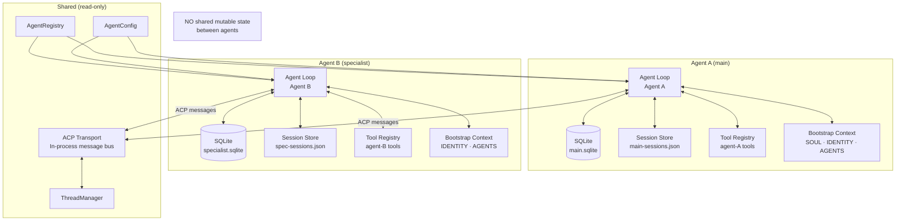
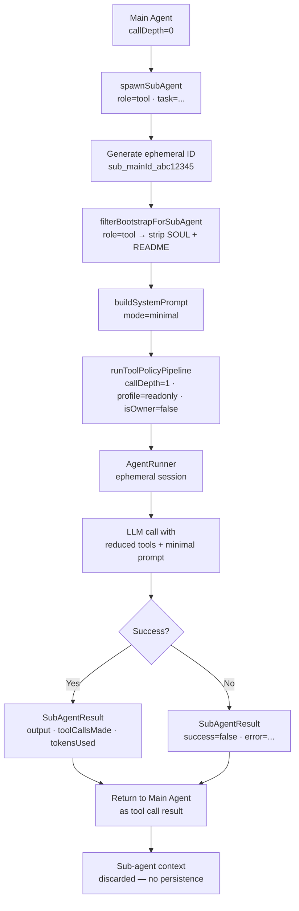
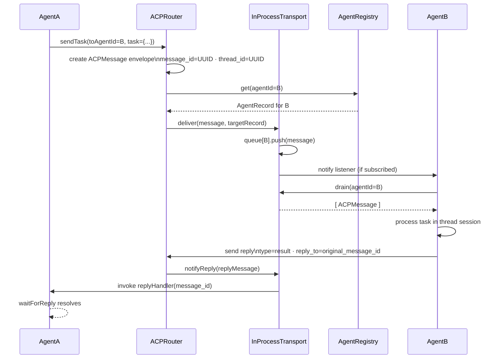
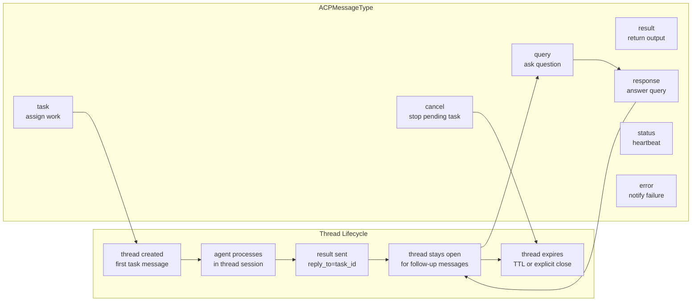
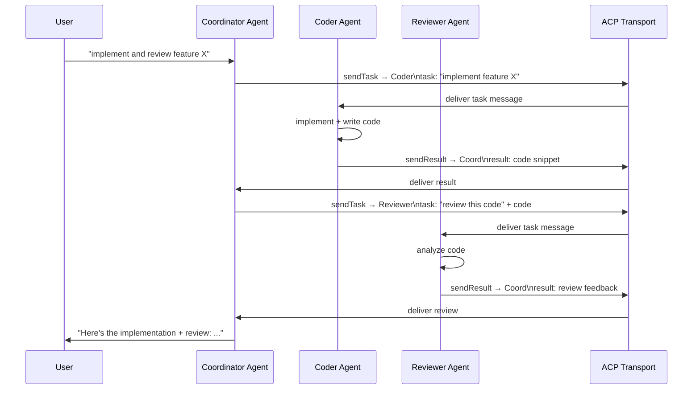

# Design Doc 07: Multi-Agent Architecture

## Overview

Multiple agents can run concurrently and communicate with each other. Each agent is a fully isolated execution context (its own session, memory DB, tool policy, system prompt). Agents communicate via the Agent Communication Protocol (ACP) — a structured message format passed through the same channel infrastructure that handles user messages. Sub-agents can also be spawned inline within a tool call for delegation.

## Core Concept

Three interaction patterns:

1. **Inline sub-agent**: Agent A spawns Agent B as a tool call. B runs synchronously, returns a result. B is ephemeral — no persistent session.
2. **Peer-to-peer via ACP**: Agent A sends an ACP message to Agent B's channel. B processes it asynchronously in its own session and replies.
3. **Orchestrator pattern**: A coordinator agent receives tasks, routes them to specialist agents, aggregates results.

**Key invariant**: Agents never share memory, session state, or tool registries. Communication is always through explicit messages, never shared mutable state.

---

## Data Model

```typescript
interface AgentRecord {
  agentId: string;
  name: string;
  role: string;                 // "coordinator", "researcher", "coder", "writer", etc.
  channelId?: string;           // ACP address for peer-to-peer messaging
  workspaceDir: string;
  cfg: AgentConfig;
  status: "active" | "idle" | "error" | "stopped";
  capabilities: string[];       // declared skill/tool groups this agent handles
  parentAgentId?: string;       // if this is a spawned sub-agent
  createdAt: number;
  lastActiveAt: number;
}

// ACP message envelope
interface ACPMessage {
  acp_version: "1.0";
  message_id: string;           // UUID
  thread_id: string;            // groups related messages into a conversation
  from_agent_id: string;
  to_agent_id: string;
  timestamp: number;
  type: ACPMessageType;
  content: ACPMessageContent;
  reply_to?: string;            // message_id this replies to
  ttl?: number;                 // seconds before message expires
  metadata?: Record<string, unknown>;
}

type ACPMessageType =
  | "task"          // assign a task
  | "result"        // return task result
  | "query"         // ask a question
  | "response"      // answer a query
  | "status"        // heartbeat/status update
  | "error"         // error notification
  | "cancel";       // cancel a pending task

interface ACPMessageContent {
  text?: string;
  data?: unknown;               // structured payload
  task?: TaskSpec;
  error?: { code: string; message: string };
}

interface TaskSpec {
  title: string;
  description: string;
  context?: string;
  tools?: string[];             // tool names the receiving agent may need
  maxTokens?: number;
  deadline?: number;            // epoch ms
}
```

---

## Agent Registry

```typescript
class AgentRegistry {
  private agents: Map<string, AgentRecord> = new Map();
  private persistence: AgentRegistryPersistence;

  register(record: AgentRecord): void {
    this.agents.set(record.agentId, record);
    this.persistence.save(record);
  }

  unregister(agentId: string): void {
    this.agents.delete(agentId);
    this.persistence.delete(agentId);
  }

  get(agentId: string): AgentRecord | undefined {
    return this.agents.get(agentId);
  }

  findByRole(role: string): AgentRecord[] {
    return [...this.agents.values()].filter(
      (a) => a.role === role && a.status === "active",
    );
  }

  findByCapability(capability: string): AgentRecord[] {
    return [...this.agents.values()].filter(
      (a) => a.capabilities.includes(capability) && a.status === "active",
    );
  }

  getPeersFor(agentId: string): AgentRecord[] {
    const self = this.agents.get(agentId);
    if (!self) return [];
    // Peers are agents in the same "cluster" — sharing a workspace or explicitly linked
    return [...this.agents.values()].filter(
      (a) =>
        a.agentId !== agentId &&
        a.status === "active" &&
        (a.workspaceDir === self.workspaceDir || isLinked(a, self)),
    );
  }

  serialize(): AgentRecord[] {
    return [...this.agents.values()];
  }
}
```

---

## Inline Sub-Agent Spawning

```typescript
interface SubAgentCallParams {
  role: "tool" | "research" | "executor" | "verifier";
  task: string;                 // the task description / prompt
  tools?: AgentTool[];          // tools available to sub-agent
  model?: string;               // model override
  maxTokens?: number;
  parentCtx: AgentExecutionContext;
}

interface SubAgentResult {
  agentId: string;
  role: string;
  output: string;
  toolCallsMade: number;
  tokensUsed: number;
  success: boolean;
  error?: string;
}

async function spawnSubAgent(params: SubAgentCallParams): Promise<SubAgentResult> {
  const { role, task, parentCtx } = params;

  // Generate ephemeral sub-agent ID
  const subAgentId = `sub_${parentCtx.agentId}_${crypto.randomUUID().slice(0, 8)}`;

  // Filter bootstrap context for sub-agent role
  const subBootstrap = filterBootstrapForSubAgent(
    parentCtx.bootstrapCtx,
    role,
  );

  // Build minimal system prompt for sub-agent
  const subPrompt = buildSystemPrompt(
    {
      ...parentCtx,
      agentId: subAgentId,
      bootstrapCtx: subBootstrap,
      skillsSnapshot: undefined,
      peerAgents: [],
      memoryExcerpts: [],
      callDepth: parentCtx.callDepth + 1,
    },
    "minimal",
  );

  // Resolve tools through policy pipeline with incremented depth
  const tools = await runToolPolicyPipeline(
    params.tools ?? parentCtx.toolRegistry.getAllTools(),
    {
      profile: BUILTIN_PROFILES.readonly,
      callDepth: parentCtx.callDepth + 1,
      isOwner: false,           // sub-agents never get owner privileges
      channelId: parentCtx.channelId,
      cfg: parentCtx.cfg,
      sessionId: subAgentId,
    },
  );

  // Run the sub-agent loop (single task, no persistent session)
  const runner = new AgentRunner({
    agentId: subAgentId,
    systemPrompt: subPrompt,
    tools,
    model: params.model ?? parentCtx.modelSpec.model,
    maxTokens: params.maxTokens ?? 4096,
    cfg: parentCtx.cfg,
  });

  try {
    const result = await runner.run(task);
    return {
      agentId: subAgentId,
      role,
      output: result.finalMessage,
      toolCallsMade: result.toolCallCount,
      tokensUsed: result.tokensUsed,
      success: true,
    };
  } catch (err) {
    return {
      agentId: subAgentId,
      role,
      output: "",
      toolCallsMade: 0,
      tokensUsed: 0,
      success: false,
      error: (err as Error).message,
    };
  }
}
```

---

## ACP Peer Messaging

```typescript
class ACPRouter {
  private registry: AgentRegistry;
  private transport: ACPTransport;

  async send(message: Omit<ACPMessage, "acp_version" | "message_id" | "timestamp">): Promise<ACPMessage> {
    const envelope: ACPMessage = {
      acp_version: "1.0",
      message_id: crypto.randomUUID(),
      timestamp: Date.now(),
      ...message,
    };

    // Validate target agent exists
    const target = this.registry.get(envelope.to_agent_id);
    if (!target) {
      throw new Error(`ACP target agent not found: ${envelope.to_agent_id}`);
    }

    // Route via transport (could be in-process queue, HTTP, WebSocket, etc.)
    await this.transport.deliver(envelope, target);
    return envelope;
  }

  async sendTask(params: {
    fromAgentId: string;
    toAgentId: string;
    task: TaskSpec;
    threadId?: string;
    ttl?: number;
  }): Promise<ACPMessage> {
    return this.send({
      from_agent_id: params.fromAgentId,
      to_agent_id: params.toAgentId,
      thread_id: params.threadId ?? crypto.randomUUID(),
      type: "task",
      content: { task: params.task },
      ttl: params.ttl,
    });
  }

  async waitForReply(messageId: string, timeoutMs: number = 30000): Promise<ACPMessage> {
    return new Promise((resolve, reject) => {
      const timer = setTimeout(
        () => reject(new Error(`ACP reply timeout for message ${messageId}`)),
        timeoutMs,
      );

      this.transport.onReply(messageId, (reply) => {
        clearTimeout(timer);
        resolve(reply);
      });
    });
  }
}
```

---

## ACP Transport Layer

```typescript
// In-process transport (single-host multi-agent)
class InProcessACPTransport implements ACPTransport {
  private queues: Map<string, ACPMessage[]> = new Map();
  private replyHandlers: Map<string, (msg: ACPMessage) => void> = new Map();
  private listeners: Map<string, ((msg: ACPMessage) => void)[]> = new Map();

  async deliver(message: ACPMessage, target: AgentRecord): Promise<void> {
    const queue = this.queues.get(target.agentId) ?? [];
    queue.push(message);
    this.queues.set(target.agentId, queue);

    // Notify any registered listeners
    const handlers = this.listeners.get(target.agentId) ?? [];
    for (const handler of handlers) {
      handler(message);
    }
  }

  onReply(messageId: string, handler: (msg: ACPMessage) => void): void {
    this.replyHandlers.set(messageId, handler);
  }

  notifyReply(message: ACPMessage): void {
    if (message.reply_to) {
      const handler = this.replyHandlers.get(message.reply_to);
      if (handler) {
        handler(message);
        this.replyHandlers.delete(message.reply_to);
      }
    }
  }

  subscribe(agentId: string, handler: (msg: ACPMessage) => void): () => void {
    const handlers = this.listeners.get(agentId) ?? [];
    handlers.push(handler);
    this.listeners.set(agentId, handlers);
    return () => {
      const current = this.listeners.get(agentId) ?? [];
      this.listeners.set(agentId, current.filter((h) => h !== handler));
    };
  }

  drain(agentId: string): ACPMessage[] {
    const msgs = this.queues.get(agentId) ?? [];
    this.queues.delete(agentId);
    return msgs;
  }
}
```

---

## Agent Isolation Guarantees

```typescript
// Each agent gets its own isolated execution context
interface AgentExecutionContext {
  agentId: string;
  // Isolated: no sharing between agents
  memoryStore: MemoryStore;          // own SQLite DB
  sessionStore: SessionStore;        // own session history
  toolRegistry: ToolRegistry;        // own tool instances
  bootstrapCtx: BootstrapContext;    // own bootstrap files
  // Shared: read-only config references
  cfg: AgentConfig;
  modelSpec: ModelSpec;
  // Call stack tracking
  callDepth: number;
  parentAgentId?: string;
}

function createIsolatedContext(record: AgentRecord): AgentExecutionContext {
  return {
    agentId: record.agentId,
    memoryStore: new MemoryStore(
      record.agentId,
      path.join(record.cfg.stateDir, "memory", `${record.agentId}.sqlite`),
    ),
    sessionStore: new SessionStore(
      path.join(record.cfg.stateDir, "sessions", `${record.agentId}.json`),
    ),
    toolRegistry: new ToolRegistry(),
    bootstrapCtx: null!, // loaded lazily
    cfg: record.cfg,
    modelSpec: resolveModelSpec(record.cfg),
    callDepth: 0,
    parentAgentId: record.parentAgentId,
  };
}
```

---

## Thread Binding (ACP)

ACP threads bind to a specific sub-conversation within an agent's session. When an ACP message arrives mid-thread, the agent resumes the thread context (not a fresh session):

```typescript
interface ACPThread {
  threadId: string;
  participantAgentIds: string[];
  messages: ACPMessage[];
  createdAt: number;
  lastActiveAt: number;
  sessionKey: string;           // which session handles this thread
}

class ThreadManager {
  private threads: Map<string, ACPThread> = new Map();

  getOrCreate(threadId: string, agentId: string, sessionKey: string): ACPThread {
    const existing = this.threads.get(threadId);
    if (existing) return existing;

    const thread: ACPThread = {
      threadId,
      participantAgentIds: [agentId],
      messages: [],
      createdAt: Date.now(),
      lastActiveAt: Date.now(),
      sessionKey,
    };
    this.threads.set(threadId, thread);
    return thread;
  }

  addMessage(threadId: string, message: ACPMessage): void {
    const thread = this.threads.get(threadId);
    if (!thread) return;
    thread.messages.push(message);
    thread.lastActiveAt = Date.now();
    if (!thread.participantAgentIds.includes(message.from_agent_id)) {
      thread.participantAgentIds.push(message.from_agent_id);
    }
  }
}
```

---

## Sandboxed Require Mode

Sub-agents that need to run untrusted code (user-submitted scripts, plugin-provided executors) run in a sandbox:

```typescript
interface SandboxConfig {
  mode: "none" | "process" | "container";
  allowedPaths?: string[];      // filesystem access (process mode)
  allowedEnv?: string[];        // env vars passed through
  networkPolicy: "none" | "localhost" | "full";
  timeoutMs: number;
}

async function runInSandbox(params: {
  code: string;
  sandbox: SandboxConfig;
  input: unknown;
}): Promise<unknown> {
  switch (params.sandbox.mode) {
    case "none":
      // Unsafe: run directly (only for trusted code)
      return runDirectly(params.code, params.input);

    case "process":
      // Fork a child process with restricted env and paths
      return runInChildProcess({
        code: params.code,
        input: params.input,
        allowedPaths: params.sandbox.allowedPaths ?? [],
        allowedEnv: params.sandbox.allowedEnv ?? [],
        timeoutMs: params.sandbox.timeoutMs,
      });

    case "container":
      // Docker container (for maximum isolation)
      return runInContainer({
        code: params.code,
        input: params.input,
        networkPolicy: params.sandbox.networkPolicy,
        timeoutMs: params.sandbox.timeoutMs,
      });
  }
}
```

---

## Diagrams

### Architecture: Agent Isolation Model



### Flow: Inline Sub-Agent Spawn



### Sequence: ACP Peer-to-Peer Messaging



### Component: ACP Message Types & Thread Flow



### Sequence: Multi-Agent Orchestration Pattern



## Implementation Checklist

- [ ] `AgentRecord` with `agentId`, `role`, `channelId`, `capabilities`, `status`
- [ ] `ACPMessage` envelope with `acp_version`, `thread_id`, `type`, `content`, `reply_to`
- [ ] `ACPMessageType`: task, result, query, response, status, error, cancel
- [ ] `AgentRegistry` with `register`, `findByRole`, `findByCapability`, `getPeersFor`
- [ ] `spawnSubAgent()` — ephemeral ID, filtered bootstrap, minimal prompt, tool policy with depth+1
- [ ] Sub-agents: no owner privileges (`isOwner: false`), `readonly` profile
- [ ] `ACPRouter.sendTask()` and `waitForReply()` with timeout
- [ ] `InProcessACPTransport` — in-memory queue + pub/sub
- [ ] `AgentExecutionContext` — isolated per agent (memory, session, tools, bootstrap)
- [ ] `ThreadManager` — ACP thread binding to session
- [ ] `SandboxConfig` — none/process/container modes
- [ ] `createIsolatedContext()` — creates fresh context for each agent
- [ ] Peer injection into system prompt (section `agent_network` in Doc 02)
- [ ] ACP message injection as `System:` lines into agent turn (via system events)
