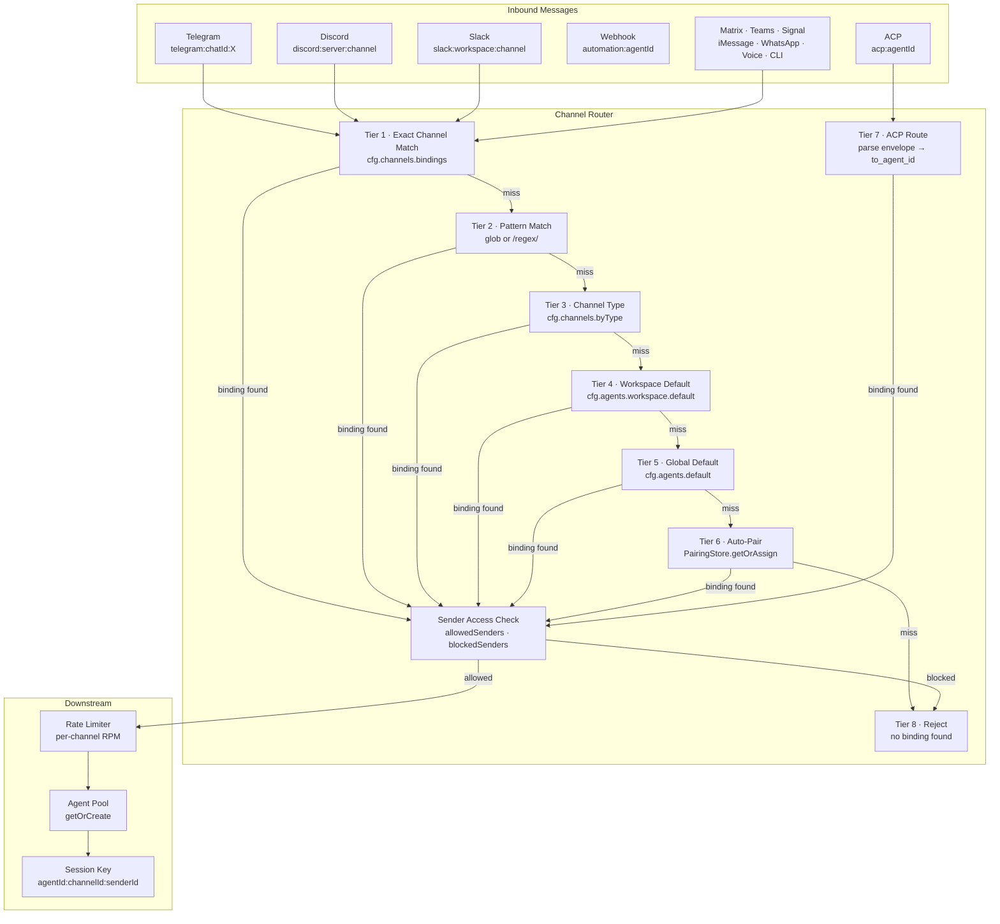
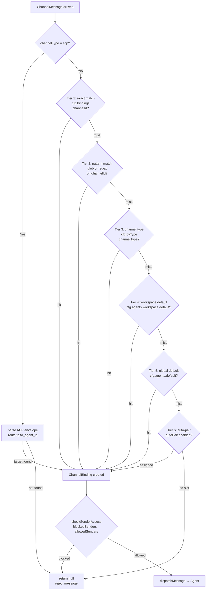
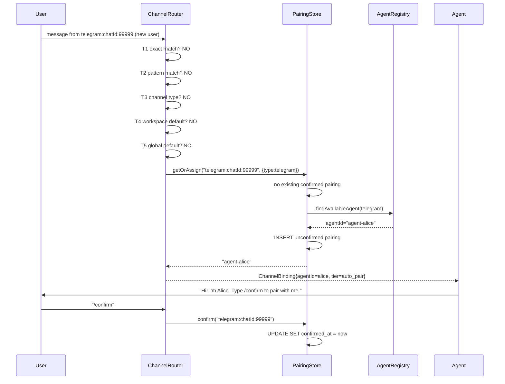
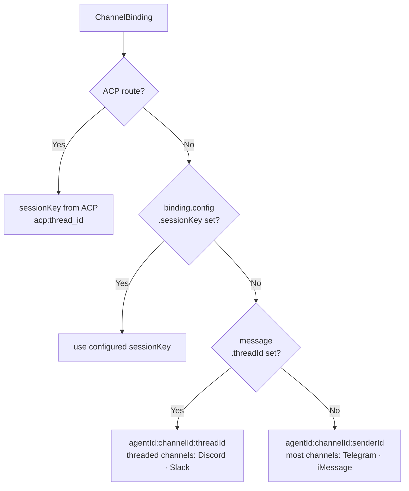
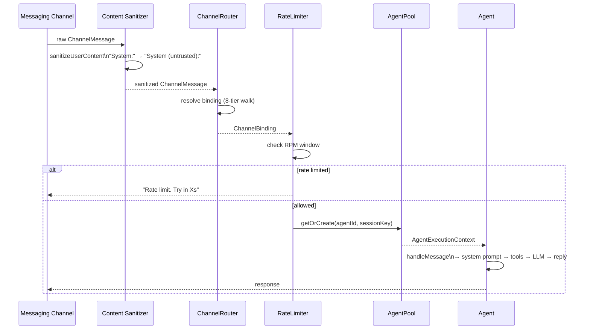

# Design Doc 08: Channel Router

## Overview

The channel router resolves which agent (and which configuration) handles an incoming message based on 8 ordered binding rules. A single gateway can serve dozens of messaging channels (Telegram, Discord, Slack, Signal, iMessage, WhatsApp, Matrix, Teams, voice calls, ACP) and route each message to the correct agent session. The binding resolution is stateless and deterministic — given the same channel ID and config, it always returns the same agent binding.

## Core Concept

When a message arrives on channel `telegram:chatId:12345`, the router walks 8 binding resolution tiers from most-specific to least-specific. The first tier that matches wins. If no tier matches, the message is rejected with a "no binding" error.

**8-Tier Binding Resolution** (most specific → least specific):

1. `exact_channel` — exact channel ID match in config
2. `pattern_channel` — wildcard/regex pattern on channel ID
3. `channel_type` — match by channel type (e.g., all Telegram messages)
4. `workspace_default` — default agent for a workspace
5. `global_default` — global default agent
6. `auto_pair` — auto-assign next available agent slot
7. `acp_route` — message is an ACP packet, route to target agent
8. `reject` — no binding found, reject with explanation

---

## Data Model

```typescript
interface ChannelMessage {
  channelId: string;            // e.g., "telegram:chatId:12345"
  channelType: ChannelType;     // "telegram", "discord", "slack", etc.
  senderId: string;             // user/bot ID within the channel
  senderName?: string;
  content: MessageContent;
  threadId?: string;            // for threaded channels (Discord, Slack)
  metadata: Record<string, unknown>;
  receivedAt: number;
}

type ChannelType =
  | "telegram" | "discord" | "slack" | "signal" | "imessage"
  | "whatsapp" | "matrix" | "msteams" | "voice" | "web" | "acp" | "cli";

interface ChannelBinding {
  agentId: string;
  sessionKey: string;           // which session within the agent
  channelId: string;
  channelType: ChannelType;
  tier: BindingTier;            // which tier resolved this
  config: ChannelBindingConfig;
}

type BindingTier =
  | "exact_channel"
  | "pattern_channel"
  | "channel_type"
  | "workspace_default"
  | "global_default"
  | "auto_pair"
  | "acp_route"
  | "reject";

interface ChannelBindingConfig {
  agentId?: string;
  sessionKey?: string;
  skillFilter?: string[];       // only load skills with these names
  toolProfile?: string;         // tool policy profile override
  allowedSenders?: string[];    // sender allowlist
  blockedSenders?: string[];    // sender blocklist
  rateLimitRpm?: number;        // rate limit for this channel
  isOwner?: boolean;            // this binding has owner-level trust
  acpEnabled?: boolean;         // whether ACP messages are accepted
}
```

---

## Router Implementation

```typescript
class ChannelRouter {
  private registry: AgentRegistry;
  private pairingStore: PairingStore;
  private cfg: GatewayConfig;

  async resolve(message: ChannelMessage): Promise<ChannelBinding | null> {
    // ACP messages have their own routing (tier 7)
    if (message.channelType === "acp") {
      return this.resolveACP(message);
    }

    // Walk tiers 1-6
    const binding =
      this.tryExactChannel(message) ??
      this.tryPatternChannel(message) ??
      this.tryChannelType(message) ??
      this.tryWorkspaceDefault(message) ??
      this.tryGlobalDefault(message) ??
      await this.tryAutoPair(message);

    if (!binding) {
      log.warn(`No binding for channel: ${message.channelId}`);
      return null; // Tier 8: reject
    }

    // Apply sender filters
    if (!this.checkSenderAccess(message, binding)) {
      log.warn(`Sender blocked: ${message.senderId} on ${message.channelId}`);
      return null;
    }

    return binding;
  }

  // Tier 1: Exact channel ID match
  private tryExactChannel(msg: ChannelMessage): ChannelBinding | null {
    const bindingCfg = this.cfg.channels?.bindings?.[msg.channelId];
    if (!bindingCfg) return null;

    return this.buildBinding(msg, bindingCfg, "exact_channel");
  }

  // Tier 2: Pattern match (glob or regex)
  private tryPatternChannel(msg: ChannelMessage): ChannelBinding | null {
    const patterns = this.cfg.channels?.patterns ?? [];

    for (const { pattern, binding } of patterns) {
      if (matchesPattern(msg.channelId, pattern)) {
        return this.buildBinding(msg, binding, "pattern_channel");
      }
    }
    return null;
  }

  // Tier 3: Channel type match
  private tryChannelType(msg: ChannelMessage): ChannelBinding | null {
    const typeCfg = this.cfg.channels?.byType?.[msg.channelType];
    if (!typeCfg) return null;

    return this.buildBinding(msg, typeCfg, "channel_type");
  }

  // Tier 4: Workspace default agent
  private tryWorkspaceDefault(msg: ChannelMessage): ChannelBinding | null {
    const workspaceDefault = this.cfg.agents?.workspace?.default;
    if (!workspaceDefault) return null;

    return this.buildBinding(msg, { agentId: workspaceDefault }, "workspace_default");
  }

  // Tier 5: Global default agent
  private tryGlobalDefault(msg: ChannelMessage): ChannelBinding | null {
    const globalDefault = this.cfg.agents?.default;
    if (!globalDefault) return null;

    return this.buildBinding(msg, { agentId: globalDefault }, "global_default");
  }

  // Tier 6: Auto-pair (assign first unpaired agent slot)
  private async tryAutoPair(msg: ChannelMessage): Promise<ChannelBinding | null> {
    if (!this.cfg.channels?.autoPair?.enabled) return null;

    const pairedAgentId = await this.pairingStore.getOrAssign(msg.channelId, {
      channelType: msg.channelType,
      senderId: msg.senderId,
    });

    if (!pairedAgentId) return null;

    return this.buildBinding(
      msg,
      { agentId: pairedAgentId },
      "auto_pair",
    );
  }

  // Tier 7: ACP routing
  private resolveACP(msg: ChannelMessage): ChannelBinding | null {
    // ACP messages embed the target agent ID in their payload
    const acpMsg = parseACPEnvelope(msg.content);
    if (!acpMsg) return null;

    const target = this.registry.get(acpMsg.to_agent_id);
    if (!target) {
      log.warn(`ACP target agent not found: ${acpMsg.to_agent_id}`);
      return null;
    }

    return {
      agentId: target.agentId,
      sessionKey: `acp:${acpMsg.thread_id}`,
      channelId: msg.channelId,
      channelType: "acp",
      tier: "acp_route",
      config: { acpEnabled: true },
    };
  }

  private buildBinding(
    msg: ChannelMessage,
    bindingCfg: ChannelBindingConfig,
    tier: BindingTier,
  ): ChannelBinding {
    const agentId = bindingCfg.agentId ?? this.cfg.agents?.default ?? "main";
    const sessionKey = bindingCfg.sessionKey ?? buildSessionKey(agentId, msg);

    return {
      agentId,
      sessionKey,
      channelId: msg.channelId,
      channelType: msg.channelType,
      tier,
      config: bindingCfg,
    };
  }

  private checkSenderAccess(msg: ChannelMessage, binding: ChannelBinding): boolean {
    const { allowedSenders, blockedSenders } = binding.config;

    if (blockedSenders?.includes(msg.senderId)) return false;
    if (allowedSenders && !allowedSenders.includes(msg.senderId)) return false;
    return true;
  }
}

function matchesPattern(channelId: string, pattern: string): boolean {
  // Support glob patterns (e.g., "telegram:*") and regex (/^discord:/)
  if (pattern.startsWith("/") && pattern.endsWith("/")) {
    const regex = new RegExp(pattern.slice(1, -1));
    return regex.test(channelId);
  }
  return minimatch(channelId, pattern);
}

function buildSessionKey(agentId: string, msg: ChannelMessage): string {
  // Session key uniquely identifies a conversation thread
  // For most channels: agent + channel + sender
  // For threaded channels: agent + channel + thread
  if (msg.threadId) {
    return `${agentId}:${msg.channelId}:thread:${msg.threadId}`;
  }
  return `${agentId}:${msg.channelId}:${msg.senderId}`;
}
```

---

## Session Key Resolution

Session keys group messages into conversations. The same user in the same channel on different devices reuses the same session:

```typescript
function resolveSessionKey(binding: ChannelBinding, msg: ChannelMessage): string {
  // ACP threads have their own session key (set during ACP routing)
  if (binding.tier === "acp_route") return binding.sessionKey;

  // Per-channel override
  if (binding.config.sessionKey) return binding.config.sessionKey;

  // Threaded channels: one session per thread
  if (msg.threadId) {
    return `${binding.agentId}:${msg.channelId}:${msg.threadId}`;
  }

  // Default: one session per sender per channel
  return `${binding.agentId}:${msg.channelId}:${msg.senderId}`;
}
```

---

## Pairing Store (Tier 6)

Auto-pairing assigns channels to agents for first-time users. The pairing is persistent:

```typescript
interface PairingRecord {
  channelId: string;
  agentId: string;
  senderId: string;
  channelType: ChannelType;
  pairedAt: number;
  confirmedAt?: number;         // if user confirmed the pairing
}

class PairingStore {
  private db: Database;

  async getOrAssign(
    channelId: string,
    params: { channelType: ChannelType; senderId: string },
  ): Promise<string | null> {
    // Check existing pairing
    const existing = this.db.prepare(
      `SELECT agent_id FROM pairings WHERE channel_id = ? AND confirmed_at IS NOT NULL`
    ).get(channelId) as { agent_id: string } | null;

    if (existing) return existing.agent_id;

    // Find next available agent slot
    const availableAgent = this.findAvailableAgent(params.channelType);
    if (!availableAgent) return null;

    // Create unconfirmed pairing (awaits user confirmation)
    this.db.prepare(`
      INSERT OR REPLACE INTO pairings (channel_id, agent_id, sender_id, channel_type, paired_at)
      VALUES (?, ?, ?, ?, ?)
    `).run(channelId, availableAgent, params.senderId, params.channelType, Date.now());

    return availableAgent;
  }

  async confirm(channelId: string): Promise<void> {
    this.db.prepare(
      `UPDATE pairings SET confirmed_at = ? WHERE channel_id = ?`
    ).run(Date.now(), channelId);
  }

  async unpair(channelId: string): Promise<void> {
    this.db.prepare(`DELETE FROM pairings WHERE channel_id = ?`).run(channelId);
  }

  private findAvailableAgent(channelType: ChannelType): string | null {
    // Agents declare max concurrent pairings; find one under limit
    // Implementation: query registry for agents with fewest active pairings
    return null; // placeholder
  }
}
```

---

## Rate Limiting

```typescript
class ChannelRateLimiter {
  private windows: Map<string, { count: number; windowStart: number }> = new Map();

  check(channelId: string, limitRpm: number): { allowed: boolean; retryAfterMs?: number } {
    const now = Date.now();
    const window = this.windows.get(channelId);

    if (!window || now - window.windowStart > 60_000) {
      // New window
      this.windows.set(channelId, { count: 1, windowStart: now });
      return { allowed: true };
    }

    if (window.count >= limitRpm) {
      const retryAfterMs = 60_000 - (now - window.windowStart);
      return { allowed: false, retryAfterMs };
    }

    window.count++;
    return { allowed: true };
  }
}
```

---

## Config Schema

```yaml
gateway:
  channels:
    autoPair:
      enabled: true
      requireConfirmation: true

    # Tier 1: exact channel bindings
    bindings:
      "telegram:chatId:12345":
        agentId: alice
        isOwner: true
      "discord:serverId:channelId":
        agentId: bob
        skillFilter: [deploy-check, git-status]
        toolProfile: readonly

    # Tier 2: pattern bindings
    patterns:
      - pattern: "telegram:groupId:*"
        binding:
          agentId: group-coordinator
          rateLimitRpm: 20

    # Tier 3: channel type defaults
    byType:
      slack:
        agentId: slack-agent
        toolProfile: full
      voice:
        agentId: voice-agent
        toolProfile: minimal

  agents:
    default: main          # Tier 5 global default
    workspace:
      default: workspace-agent  # Tier 4 workspace default
```

---

## Message Dispatch Pipeline

```typescript
async function dispatchMessage(
  msg: ChannelMessage,
  router: ChannelRouter,
  limiter: ChannelRateLimiter,
  agentPool: AgentPool,
): Promise<void> {
  // 1. Resolve binding
  const binding = await router.resolve(msg);
  if (!binding) {
    await sendReply(msg, "Sorry, I don't have an agent configured for this channel.");
    return;
  }

  // 2. Rate limit check
  if (binding.config.rateLimitRpm) {
    const check = limiter.check(msg.channelId, binding.config.rateLimitRpm);
    if (!check.allowed) {
      await sendReply(msg, `Rate limit exceeded. Try again in ${Math.ceil((check.retryAfterMs ?? 0) / 1000)}s.`);
      return;
    }
  }

  // 3. Get or create agent execution context
  const sessionKey = resolveSessionKey(binding, msg);
  const agent = await agentPool.getOrCreate(binding.agentId, sessionKey);

  // 4. Dispatch message to agent
  await agent.handleMessage({
    message: msg,
    binding,
    sessionKey,
    isOwner: binding.config.isOwner ?? false,
  });
}
```

---

## Diagrams

### Architecture: Channel Router System



### Flow: 8-Tier Binding Resolution



### Sequence: First-Time User Auto-Pairing



### Component: Session Key Resolution



### Sequence: Full Message Dispatch Pipeline



## Implementation Checklist

- [ ] `ChannelBinding` with `agentId`, `sessionKey`, `tier`, `config`
- [ ] `BindingTier` enum: 8 tiers in resolution order
- [ ] `ChannelRouter.resolve()` — walk tiers 1→6, reject on no match
- [ ] Tier 1: `tryExactChannel()` — exact `cfg.channels.bindings[channelId]`
- [ ] Tier 2: `tryPatternChannel()` — glob and regex pattern matching via `minimatch`
- [ ] Tier 3: `tryChannelType()` — `cfg.channels.byType[channelType]`
- [ ] Tier 4: `tryWorkspaceDefault()` — `cfg.agents.workspace.default`
- [ ] Tier 5: `tryGlobalDefault()` — `cfg.agents.default`
- [ ] Tier 6: `tryAutoPair()` — `PairingStore.getOrAssign()`
- [ ] Tier 7: `resolveACP()` — parse ACP envelope, route to `to_agent_id`
- [ ] Tier 8: return `null` → caller rejects with error reply
- [ ] `checkSenderAccess()` — allowedSenders / blockedSenders
- [ ] `buildSessionKey()` — agentId + channelId + threadId or senderId
- [ ] `PairingStore` — SQLite-backed, confirmed/unconfirmed pairings
- [ ] `ChannelRateLimiter` — per-channel RPM window
- [ ] `dispatchMessage()` — binding → rate limit → agent pool → handleMessage
- [ ] Config schema: bindings, patterns, byType, default, workspace.default
