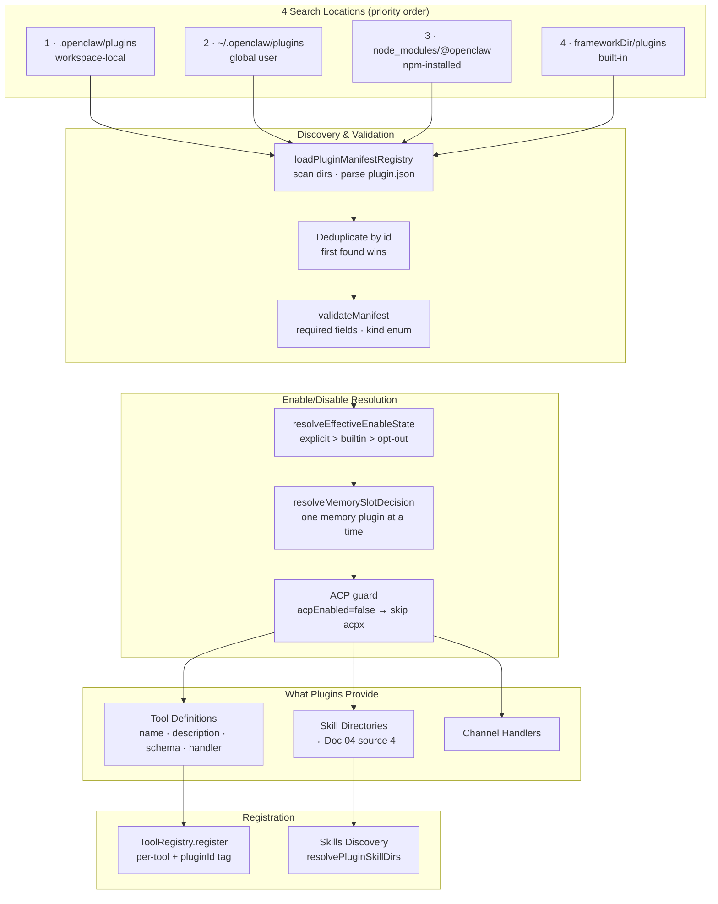
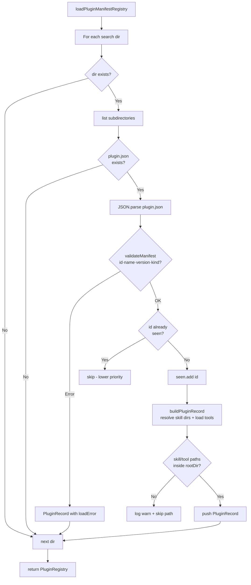
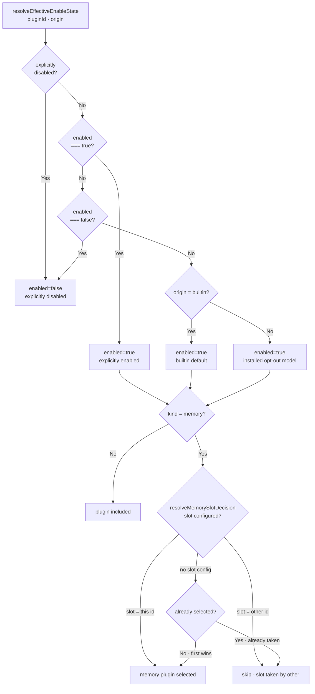
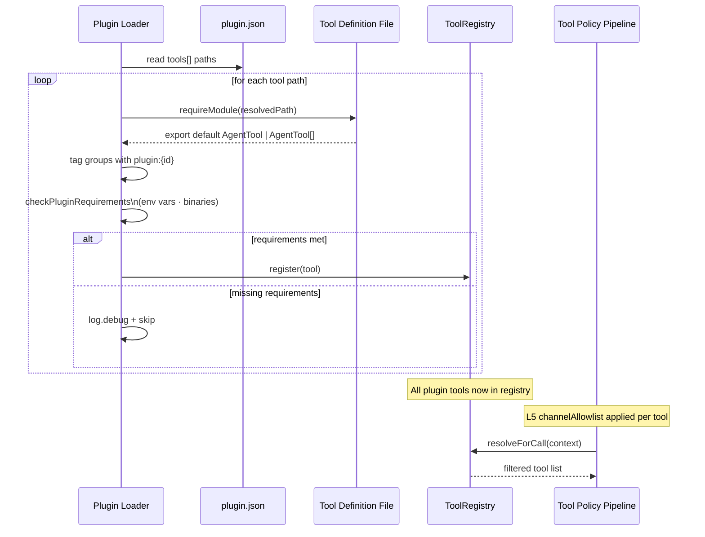

# Design Doc 09: Plugin System

## Overview

Plugins extend the agent framework with new tools, skills, and capabilities without modifying core code. Each plugin is an npm package with a manifest (`plugin.json`) that declares what it provides. The plugin registry discovers installed plugins, validates their manifests, and makes their tools and skills available to the agent through the tool policy pipeline and skills system.

## Core Concept

A plugin is a directory containing:
- `plugin.json` — manifest (id, kind, tools, skills, capabilities)
- Tool handlers (TypeScript/JavaScript files)
- Skill directories with `SKILL.md` files

Plugins are discovered from fixed locations. Plugin tools go through the same 8-layer tool policy pipeline as built-in tools. Plugin skills go through the same 6-source skill discovery as workspace skills.

**Plugin kinds**: `tool`, `memory`, `channel`, `skill-pack`, `integration`

---

## Plugin Manifest

```typescript
interface PluginManifest {
  id: string;                   // unique, e.g., "openclaw-jira"
  name: string;                 // display name
  version: string;              // semver
  kind: PluginKind;
  description: string;
  author?: string;
  homepage?: string;

  // What this plugin provides
  tools?: string[];             // relative paths to tool definition files
  skills?: string[];            // relative paths to skill directories
  channels?: string[];          // channel type IDs this plugin handles

  // Dependencies and requirements
  requires?: {
    openclaw?: string;          // semver range for host compatibility
    node?: string;
    env?: string[];             // required env vars
    binaries?: string[];        // required binaries in PATH
  };

  // Memory plugin slot (only one memory plugin active at a time)
  slot?: "memory";

  // Config schema (JSON Schema for plugin-specific config)
  configSchema?: JSONSchema;
}

type PluginKind =
  | "tool"           // adds tools
  | "memory"         // replaces memory system (one active at a time)
  | "channel"        // adds messaging channel support
  | "skill-pack"     // adds skill directories only
  | "integration"    // external service integration (tools + skills)
  | "router"         // ACP routing plugin
  | "meta";          // meta-plugin that loads other plugins
```

---

## Plugin Discovery Locations

```typescript
const PLUGIN_SEARCH_DIRS = [
  // 1. Workspace-local plugins (highest priority)
  path.join(workspaceDir, ".openclaw/plugins"),
  // 2. Global user plugins
  path.join(os.homedir(), ".openclaw/plugins"),
  // 3. npm-installed plugins (node_modules/@openclaw/*)
  path.join(workspaceDir, "node_modules/@openclaw"),
  path.join(os.homedir(), ".openclaw", "node_modules", "@openclaw"),
  // 4. Framework built-in plugins (shipped with core)
  path.join(frameworkDir, "plugins"),
];
```

---

## Plugin Manifest Registry

```typescript
interface PluginRecord {
  id: string;
  manifest: PluginManifest;
  rootDir: string;
  origin: "workspace" | "global" | "npm" | "builtin";
  skills: string[];             // resolved from manifest.skills
  tools: ToolDefinition[];      // loaded from manifest.tools
  loadError?: string;           // if manifest failed to load
}

interface PluginRegistry {
  plugins: PluginRecord[];
  loadedAt: number;
}

function loadPluginManifestRegistry(params: {
  workspaceDir: string;
  config?: AgentConfig;
}): PluginRegistry {
  const plugins: PluginRecord[] = [];
  const seen = new Set<string>(); // dedup by plugin ID

  for (const searchDir of PLUGIN_SEARCH_DIRS) {
    if (!fs.existsSync(searchDir)) continue;

    const entries = fs.readdirSync(searchDir, { withFileTypes: true });

    for (const entry of entries) {
      if (!entry.isDirectory()) continue;
      const pluginDir = path.join(searchDir, entry.name);
      const manifestPath = path.join(pluginDir, "plugin.json");

      if (!fs.existsSync(manifestPath)) continue;

      let manifest: PluginManifest;
      try {
        const raw = fs.readFileSync(manifestPath, "utf8");
        manifest = JSON.parse(raw);
        validateManifest(manifest);
      } catch (err) {
        plugins.push({
          id: entry.name,
          manifest: {} as PluginManifest,
          rootDir: pluginDir,
          origin: inferOrigin(searchDir),
          skills: [],
          tools: [],
          loadError: String(err),
        });
        continue;
      }

      if (seen.has(manifest.id)) {
        log.debug(`Plugin '${manifest.id}' already registered, skipping ${pluginDir}`);
        continue;
      }
      seen.add(manifest.id);

      const record = buildPluginRecord(manifest, pluginDir, searchDir);
      plugins.push(record);
    }
  }

  return { plugins, loadedAt: Date.now() };
}

function buildPluginRecord(
  manifest: PluginManifest,
  rootDir: string,
  searchDir: string,
): PluginRecord {
  // Resolve skill directories
  const skills = (manifest.skills ?? [])
    .map((s) => path.resolve(rootDir, s))
    .filter((p) => {
      if (!fs.existsSync(p)) {
        log.warn(`Plugin '${manifest.id}' skill path not found: ${p}`);
        return false;
      }
      if (!isPathInside(rootDir, p)) {
        log.warn(`Plugin '${manifest.id}' skill path escapes root: ${p}`);
        return false;
      }
      return true;
    });

  // Load tool definitions
  const tools = (manifest.tools ?? [])
    .flatMap((toolPath) => {
      const resolved = path.resolve(rootDir, toolPath);
      if (!fs.existsSync(resolved)) {
        log.warn(`Plugin '${manifest.id}' tool path not found: ${resolved}`);
        return [];
      }
      try {
        return loadToolDefinitions(resolved, manifest.id);
      } catch (err) {
        log.warn(`Plugin '${manifest.id}' tool load error: ${err}`);
        return [];
      }
    });

  return {
    id: manifest.id,
    manifest,
    rootDir,
    origin: inferOrigin(searchDir),
    skills,
    tools,
  };
}
```

---

## Enable/Disable State Resolution

```typescript
interface NormalizedPluginsConfig {
  enabled: Record<string, boolean>;  // explicit enable/disable per plugin ID
  disabled: string[];                // shorthand disable list
  slots: {
    memory?: string;                 // which memory plugin to use
  };
}

interface EnableStateResult {
  enabled: boolean;
  reason: string;
}

function resolveEffectiveEnableState(params: {
  id: string;
  origin: PluginRecord["origin"];
  config: NormalizedPluginsConfig;
  rootConfig?: AgentConfig;
}): EnableStateResult {
  const { id, config } = params;

  // Explicit disable
  if (config.disabled.includes(id)) {
    return { enabled: false, reason: "explicitly disabled" };
  }

  // Explicit enable
  if (config.enabled[id] === true) {
    return { enabled: true, reason: "explicitly enabled" };
  }
  if (config.enabled[id] === false) {
    return { enabled: false, reason: "explicitly disabled" };
  }

  // Builtin plugins are enabled by default
  if (params.origin === "builtin") {
    return { enabled: true, reason: "builtin default" };
  }

  // Workspace/npm plugins: enabled if installed (opt-out model)
  return { enabled: true, reason: "installed, no explicit config" };
}

function resolveMemorySlotDecision(params: {
  id: string;
  kind: PluginKind;
  slot: string | undefined;          // configured memory plugin ID
  selectedId: string | null;         // already selected memory plugin
}): { enabled: boolean } {
  if (params.kind !== "memory") return { enabled: true };

  // If a specific memory plugin is configured, use only that one
  if (params.slot) {
    return { enabled: params.id === params.slot };
  }

  // Otherwise: first memory plugin wins (in discovery order)
  return { enabled: params.selectedId === null };
}
```

---

## Tool Loading from Plugin

```typescript
interface ToolDefinition {
  name: string;
  description: string;
  inputSchema: JSONSchema;
  handler: ToolHandler;
  groups?: string[];
  pluginId: string;
  ownerOnly?: boolean;
}

function loadToolDefinitions(filePath: string, pluginId: string): ToolDefinition[] {
  // Dynamic import for ESM plugins
  const module = requireModule(filePath);

  // Plugin tool files export either a single tool or an array
  const exports = module.default ?? module;
  const raw: unknown[] = Array.isArray(exports) ? exports : [exports];

  return raw
    .filter((t): t is ToolDefinition => {
      return (
        typeof t === "object" &&
        t !== null &&
        "name" in t &&
        "description" in t &&
        "handler" in t
      );
    })
    .map((t) => ({
      ...t,
      pluginId,
      // Tag plugin tools so the policy pipeline can filter by plugin
      groups: [...(t.groups ?? []), `plugin:${pluginId}`],
    }));
}
```

---

## Plugin Registration into Tool Registry

```typescript
function registerPluginTools(
  registry: ToolRegistry,
  pluginRecord: PluginRecord,
  cfg: AgentConfig,
): void {
  for (const toolDef of pluginRecord.tools) {
    // Check plugin-level requirements before registering
    if (!checkPluginRequirements(pluginRecord.manifest)) {
      log.debug(`Plugin '${pluginRecord.id}' requirements not met, skipping tool: ${toolDef.name}`);
      continue;
    }

    const tool: AgentTool = {
      name: toolDef.name,
      description: toolDef.description,
      inputSchema: toolDef.inputSchema,
      handler: toolDef.handler,
      groups: toolDef.groups,
      pluginId: pluginRecord.id,
      ownerOnly: toolDef.ownerOnly,
      // Plugin tools get channelAllowlist if config restricts them
      channelAllowlist: cfg.plugins?.channelRestrictions?.[toolDef.name],
    };

    try {
      registry.register(tool);
    } catch (err) {
      // Duplicate tool name — log and skip
      log.warn(`Plugin '${pluginRecord.id}' tool '${toolDef.name}' registration failed: ${err}`);
    }
  }
}

function checkPluginRequirements(manifest: PluginManifest): boolean {
  if (!manifest.requires) return true;

  if (manifest.requires.env) {
    for (const envVar of manifest.requires.env) {
      if (!process.env[envVar]) {
        log.debug(`Plugin requires env var '${envVar}' — not set`);
        return false;
      }
    }
  }

  if (manifest.requires.binaries) {
    for (const binary of manifest.requires.binaries) {
      if (!isBinaryInPath(binary)) {
        log.debug(`Plugin requires binary '${binary}' — not in PATH`);
        return false;
      }
    }
  }

  return true;
}
```

---

## Plugin Config Schema Validation

```typescript
function validatePluginConfig(
  pluginId: string,
  userConfig: unknown,
  schema: JSONSchema,
): { valid: boolean; errors: string[] } {
  const validator = new JSONSchemaValidator();
  const result = validator.validate(userConfig, schema);

  if (!result.valid) {
    log.warn(`Plugin '${pluginId}' config validation failed:`, result.errors);
  }

  return {
    valid: result.valid,
    errors: result.errors.map((e) => e.message),
  };
}
```

---

## Plugin Manifest Validation

```typescript
function validateManifest(manifest: unknown): asserts manifest is PluginManifest {
  if (typeof manifest !== "object" || manifest === null) {
    throw new Error("Plugin manifest must be an object");
  }
  const m = manifest as Record<string, unknown>;

  if (typeof m.id !== "string" || !m.id.trim()) {
    throw new Error("Plugin manifest missing required field: id");
  }
  if (typeof m.name !== "string" || !m.name.trim()) {
    throw new Error("Plugin manifest missing required field: name");
  }
  if (typeof m.version !== "string") {
    throw new Error("Plugin manifest missing required field: version");
  }

  const validKinds: PluginKind[] = ["tool", "memory", "channel", "skill-pack", "integration", "router", "meta"];
  if (!validKinds.includes(m.kind as PluginKind)) {
    throw new Error(`Plugin manifest invalid kind: ${m.kind}`);
  }
}
```

---

## Config

```yaml
plugins:
  # Disable specific plugins
  disabled:
    - openclaw-experimental-tools

  # Enable specific plugins (opt-in for non-installed)
  enabled:
    my-custom-plugin: true

  # Memory slot: which memory plugin to use
  slots:
    memory: openclaw-mem0        # use mem0 instead of built-in SQLite

  # Channel restrictions: tool only available on specific channels
  channelRestrictions:
    jira_create_issue:
      - "slack:C123456"
      - "teams:team:channel"
```

---

## Diagrams

### Architecture: Plugin System Components



### Flow: Plugin Discovery & Load



### Flow: Enable State Resolution



### Component: Plugin Tool Registration Flow



## Implementation Checklist

- [ ] `PluginManifest` interface with `id`, `kind`, `tools`, `skills`, `requires`, `slot`
- [ ] `PluginKind` enum: tool, memory, channel, skill-pack, integration, router, meta
- [ ] `PluginRecord` with `id`, `manifest`, `rootDir`, `origin`, `skills[]`, `tools[]`
- [ ] 4 plugin search dirs in priority order
- [ ] `loadPluginManifestRegistry()` — scan dirs, parse manifests, dedupe by ID
- [ ] `buildPluginRecord()` — resolve skill dirs, load tool definitions
- [ ] Path traversal guard: skill/tool paths must be inside `rootDir`
- [ ] `validateManifest()` — required fields check, kind enum check
- [ ] `resolveEffectiveEnableState()` — explicit > builtin default > opt-out
- [ ] `resolveMemorySlotDecision()` — only one memory plugin active
- [ ] `loadToolDefinitions()` — dynamic import, single or array export
- [ ] `registerPluginTools()` — register into ToolRegistry with plugin group tag
- [ ] `checkPluginRequirements()` — env vars and binary checks
- [ ] `validatePluginConfig()` — JSON Schema validation of user config
- [ ] Plugin tool `channelAllowlist` from `cfg.plugins.channelRestrictions`
- [ ] ACP plugin (`acpx`) disabled when `cfg.acp.enabled === false`
