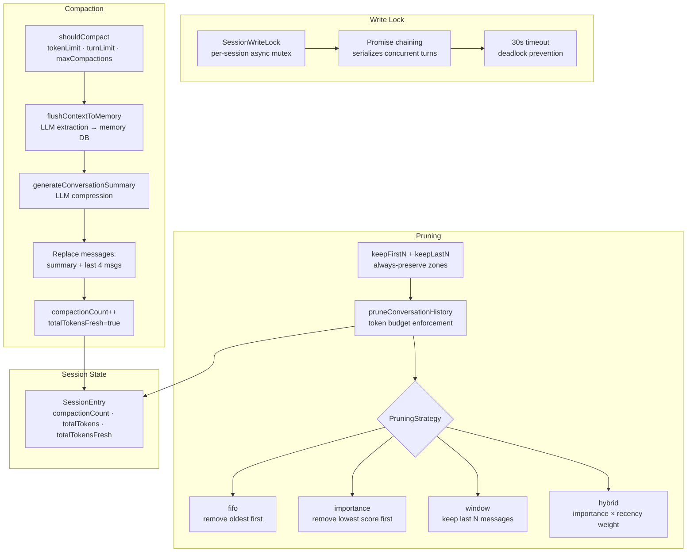
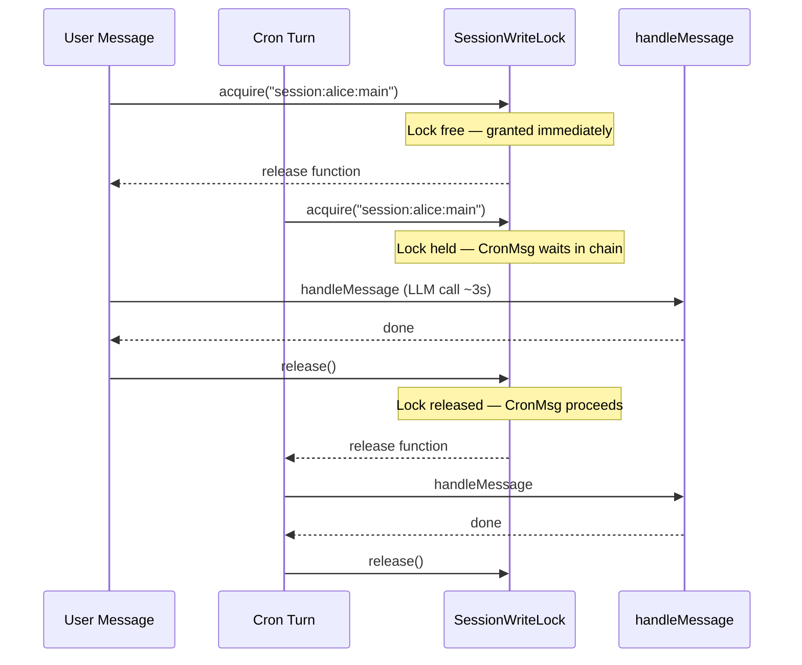
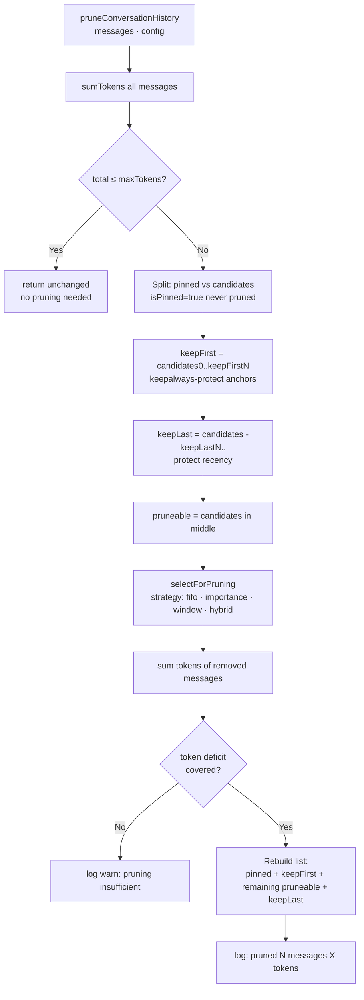
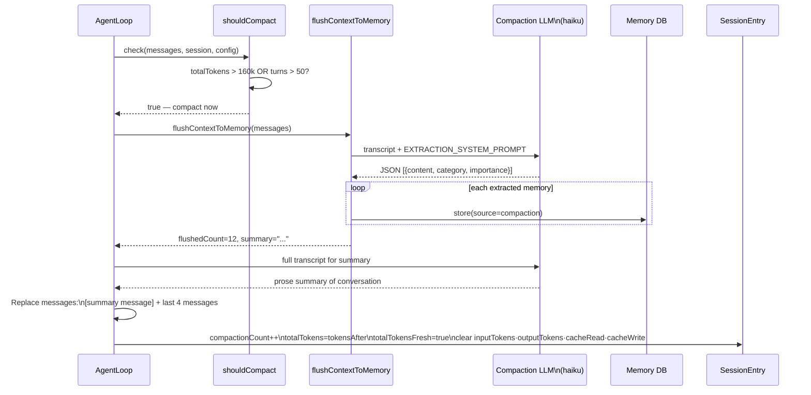
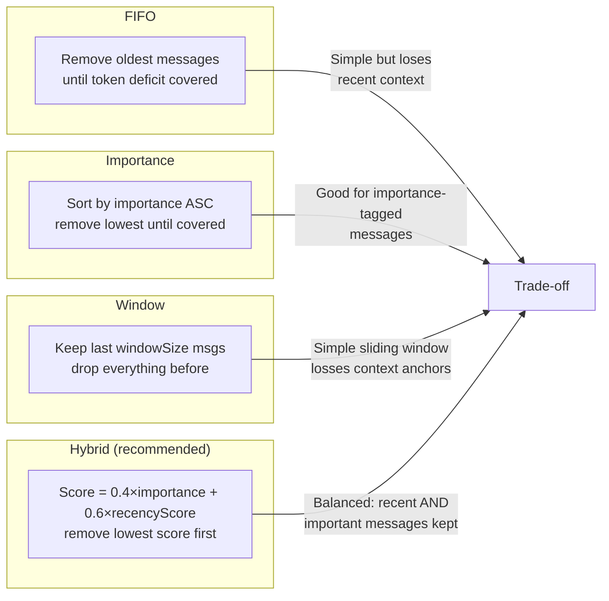

# Design Doc 10: Context Management Extensions

## Overview

Context management extends the base agent loop with three capabilities: **write lock** (prevent concurrent writes to the same session), **context pruning** (strategically trim old messages to fit in context window), and **compaction** (LLM-guided compression of conversation history with memory flush). Together these keep long-running sessions functional without hitting context limits.

## Core Concept

The base Pi Agent loop simply appends messages. Without context management:
- Two concurrent turns corrupt the session state
- Long conversations hit the model's context window limit and fail
- Important context from old turns is lost forever

With context management extensions:
- Write lock serializes concurrent turns per session
- Pruning extends session lifetime by removing low-value messages
- Compaction compresses old history into a summary and flushes facts to memory

---

## Write Lock

### Problem
When two messages arrive simultaneously (e.g., user sends while cron fires), both try to read+update the session concurrently. Without locking, one write wins and the other is lost.

### Solution
Per-session async mutex using a file-backed or in-memory lock.

```typescript
class SessionWriteLock {
  private locks: Map<string, Promise<void>> = new Map();

  async acquire(sessionKey: string): Promise<() => void> {
    // Chain on existing lock for this session
    const existing = this.locks.get(sessionKey) ?? Promise.resolve();
    let release!: () => void;

    const next = existing.then(
      () =>
        new Promise<void>((resolve) => {
          release = resolve;
        }),
    );

    this.locks.set(sessionKey, next.catch(() => {}));

    // Wait for our turn
    await existing;
    return release;
  }

  async withLock<T>(sessionKey: string, fn: () => Promise<T>): Promise<T> {
    const release = await this.acquire(sessionKey);
    try {
      return await fn();
    } finally {
      release();
      // Clean up if no more waiters
      if (this.locks.get(sessionKey) === Promise.resolve()) {
        this.locks.delete(sessionKey);
      }
    }
  }
}

// Usage in message dispatch
const sessionLock = new SessionWriteLock();

async function handleMessageSafe(sessionKey: string, msg: ChannelMessage): Promise<void> {
  await sessionLock.withLock(sessionKey, async () => {
    await handleMessage(sessionKey, msg);
  });
}
```

### Lock Timeout
Prevent deadlocks from stalled handlers:

```typescript
async function withLockTimeout<T>(
  lock: SessionWriteLock,
  sessionKey: string,
  fn: () => Promise<T>,
  timeoutMs: number = 30_000,
): Promise<T> {
  const timeoutPromise = new Promise<never>((_, reject) =>
    setTimeout(() => reject(new Error(`Session lock timeout: ${sessionKey}`)), timeoutMs),
  );

  return Promise.race([
    lock.withLock(sessionKey, fn),
    timeoutPromise,
  ]);
}
```

---

## Context Pruning

Pruning removes messages from the conversation history before they hit the context limit, preserving the most important context.

### Pruning Strategy

```typescript
type PruningStrategy =
  | "fifo"         // remove oldest messages first (simple)
  | "importance"   // remove lowest-importance messages first
  | "window"       // keep only the last N messages
  | "hybrid";      // importance-weighted sliding window

interface PruningConfig {
  strategy: PruningStrategy;
  maxTokens: number;            // target token budget for conversation history
  keepFirstN?: number;          // always keep first N messages (context anchors)
  keepLastN?: number;           // always keep last N messages (recency)
  importanceThreshold?: number; // don't prune messages above this importance
  windowSize?: number;          // for "window" strategy
}

interface MessageWithMeta extends Message {
  importance?: number;          // 0.0–1.0 (assigned during message processing)
  tokenCount?: number;          // pre-computed token estimate
  isPinned?: boolean;           // never prune (system messages, tool results)
}
```

### Pruning Algorithm

```typescript
function pruneConversationHistory(
  messages: MessageWithMeta[],
  config: PruningConfig,
): MessageWithMeta[] {
  const totalTokens = sumTokens(messages);
  if (totalTokens <= config.maxTokens) return messages; // no pruning needed

  // Split into pinned (never prune) and candidates
  const pinned = messages.filter((m) => m.isPinned);
  const candidates = messages.filter((m) => !m.isPinned);

  // Always-keep zones
  const keepFirst = candidates.slice(0, config.keepFirstN ?? 2);
  const keepLast = candidates.slice(-(config.keepLastN ?? 6));
  const pruneable = candidates.slice(
    config.keepFirstN ?? 2,
    candidates.length - (config.keepLastN ?? 6),
  );

  // Select which pruneable messages to remove
  const toRemove = selectForPruning(pruneable, config, totalTokens - config.maxTokens);
  const pruneSet = new Set(toRemove.map((m, i) => i));

  const kept = [
    ...pinned,
    ...keepFirst,
    ...pruneable.filter((_, i) => !pruneSet.has(i)),
    ...keepLast,
  ];

  log.debug(`Pruned ${toRemove.length} messages (${sumTokens(toRemove)} tokens removed)`);
  return kept;
}

function selectForPruning(
  candidates: MessageWithMeta[],
  config: PruningConfig,
  tokenDeficit: number,
): MessageWithMeta[] {
  switch (config.strategy) {
    case "fifo":
      return selectFIFO(candidates, tokenDeficit);

    case "importance":
      return selectByImportance(candidates, tokenDeficit, config.importanceThreshold ?? 0.5);

    case "window":
      return candidates.slice(0, Math.max(0, candidates.length - (config.windowSize ?? 20)));

    case "hybrid":
      // Score = importance * recency_weight
      return selectHybrid(candidates, tokenDeficit, config);
  }
}

function selectFIFO(candidates: MessageWithMeta[], tokenDeficit: number): MessageWithMeta[] {
  const removed: MessageWithMeta[] = [];
  let freed = 0;
  for (const msg of candidates) {
    if (freed >= tokenDeficit) break;
    removed.push(msg);
    freed += msg.tokenCount ?? estimateTokens(contentToString(msg.content));
  }
  return removed;
}

function selectByImportance(
  candidates: MessageWithMeta[],
  tokenDeficit: number,
  threshold: number,
): MessageWithMeta[] {
  // Sort by importance ascending (lowest first = remove first)
  const sorted = [...candidates]
    .map((m, i) => ({ msg: m, idx: i }))
    .filter(({ msg }) => (msg.importance ?? 0.5) < threshold)
    .sort((a, b) => (a.msg.importance ?? 0.5) - (b.msg.importance ?? 0.5));

  const removed: MessageWithMeta[] = [];
  let freed = 0;
  for (const { msg } of sorted) {
    if (freed >= tokenDeficit) break;
    removed.push(msg);
    freed += msg.tokenCount ?? estimateTokens(contentToString(msg.content));
  }
  return removed;
}

function selectHybrid(
  candidates: MessageWithMeta[],
  tokenDeficit: number,
  config: PruningConfig,
): MessageWithMeta[] {
  const n = candidates.length;
  const scored = candidates.map((msg, i) => {
    const recencyScore = 1 - i / n; // older = lower recency
    const importance = msg.importance ?? 0.5;
    // Higher score = more valuable = keep
    const keepScore = 0.4 * importance + 0.6 * recencyScore;
    return { msg, keepScore };
  });

  // Sort by keepScore ascending (lowest = remove first)
  scored.sort((a, b) => a.keepScore - b.keepScore);

  const removed: MessageWithMeta[] = [];
  let freed = 0;
  for (const { msg } of scored) {
    if (freed >= tokenDeficit) break;
    removed.push(msg);
    freed += msg.tokenCount ?? estimateTokens(contentToString(msg.content));
  }
  return removed;
}
```

---

## Compaction

Compaction is a more aggressive operation than pruning. It summarizes the full conversation history using the LLM, flushes important facts to memory, and replaces the old messages with the summary.

### When to Compact

```typescript
interface CompactionTrigger {
  maxTokens: number;            // compact when conversation exceeds this
  maxTurns: number;             // compact after this many turns
  maxCompactions: number;       // stop compacting after N times (prevent loops)
}

function shouldCompact(params: {
  messages: Message[];
  sessionEntry: SessionEntry;
  trigger: CompactionTrigger;
}): boolean {
  const { messages, sessionEntry, trigger } = params;

  // Never compact if already at max compactions
  if ((sessionEntry.compactionCount ?? 0) >= trigger.maxCompactions) return false;

  // Compact if over token limit
  const totalTokens = sessionEntry.totalTokens ?? sumTokens(messages);
  if (totalTokens > trigger.maxTokens) return true;

  // Compact if over turn limit
  const turnCount = messages.filter((m) => m.role === "user").length;
  if (turnCount > trigger.maxTurns) return true;

  return false;
}
```

### Compaction Pipeline

```typescript
async function compactSession(params: {
  messages: Message[];
  sessionEntry: SessionEntry;
  agentId: string;
  cfg: AgentConfig;
  memoryStore?: MemoryStore;
}): Promise<{
  compactedMessages: Message[];
  newSessionEntry: SessionEntry;
  flushedMemoryCount: number;
}> {
  const { messages, sessionEntry, agentId, cfg } = params;

  // Step 1: Extract and flush important facts to memory
  let flushedMemoryCount = 0;
  if (params.memoryStore) {
    const { flushedCount, summary } = await flushContextToMemory({
      agentId,
      conversationHistory: messages,
      cfg,
    });
    flushedMemoryCount = flushedCount;
    log.debug(`Compaction flushed ${flushedCount} memories for agent ${agentId}`);
  }

  // Step 2: Generate a conversation summary via LLM
  const summary = await generateConversationSummary(messages, cfg);

  // Step 3: Build compacted message list
  // Keep: system prompt injection (pinned), then summary, then last few messages
  const keepLastN = cfg.compaction?.keepLastN ?? 4;
  const recentMessages = messages.slice(-keepLastN);
  const summaryMessage: Message = {
    role: "user",
    content: `[Conversation summary — earlier context compressed]\n\n${summary}`,
  };
  const compactedMessages = [summaryMessage, ...recentMessages];

  // Step 4: Estimate new token count
  const tokensAfter = sumTokens(compactedMessages);

  // Step 5: Increment compaction counter in session
  const newCompactionCount = (sessionEntry.compactionCount ?? 0) + 1;
  const newSessionEntry: SessionEntry = {
    ...sessionEntry,
    compactionCount: newCompactionCount,
    totalTokens: tokensAfter,
    totalTokensFresh: true,
    inputTokens: undefined,
    outputTokens: undefined,
    cacheRead: undefined,
    cacheWrite: undefined,
    updatedAt: Date.now(),
  };

  return { compactedMessages, newSessionEntry, flushedMemoryCount };
}

async function generateConversationSummary(
  messages: Message[],
  cfg: AgentConfig,
): Promise<string> {
  const compactionModel = cfg.compaction?.model ?? cfg.model?.primary ?? "claude-haiku-4-5-20251001";

  // Build a text transcript for the compaction model
  const transcript = messages
    .filter((m) => m.role !== "tool") // skip tool call results for summary
    .map((m) => `${m.role.toUpperCase()}: ${contentToString(m.content)}`)
    .join("\n\n");

  const response = await callLLM({
    model: compactionModel,
    system: COMPACTION_SYSTEM_PROMPT,
    messages: [
      {
        role: "user",
        content: `Please summarize this conversation:\n\n${transcript}`,
      },
    ],
    maxTokens: 1500,
  });

  return response.content;
}

const COMPACTION_SYSTEM_PROMPT = `
You are a conversation summarizer. Create a concise but complete summary of the conversation.
Include:
- Key decisions made
- Important facts established
- Tasks completed or in progress
- User preferences expressed
- Critical context for continuing the conversation

Be factual and preserve specific details (names, values, URLs, file paths).
Write in third person: "The user asked...", "The assistant explained...".
`.trim();
```

---

## Identifier Preservation During Compaction

When summarizing, the LLM must preserve entity identifiers:

```typescript
// Inject before the transcript in compaction prompt
const IDENTIFIER_PRESERVATION_HINT = `
IMPORTANT: Preserve all specific identifiers verbatim in your summary:
- File paths, URLs, IDs, config keys
- Code snippets that were referenced
- Error messages or stack traces
- Dates, times, version numbers
Do not paraphrase these — copy them exactly.
`.trim();
```

---

## OAI Server Compaction (Passthrough)

When using an OpenAI-compatible server that supports server-side compaction, defer to it:

```typescript
interface OAICompactionConfig {
  enabled: boolean;
  provider: string;             // "openai", "together", etc.
  maxContextFraction: number;   // compact when context is this % full
}

async function handleOAICompaction(
  response: LLMResponse,
  sessionEntry: SessionEntry,
): Promise<SessionEntry> {
  // OAI-compatible servers may return a `context_tokens_used` field
  // and a `finish_reason: "length"` indicating context overflow
  if (response.finishReason !== "length") return sessionEntry;

  // The server already truncated — our job is to record the new token count
  const tokensAfter = response.usage?.promptTokens ?? sessionEntry.totalTokens ?? 0;

  return {
    ...sessionEntry,
    totalTokens: tokensAfter,
    totalTokensFresh: true,
    compactionCount: (sessionEntry.compactionCount ?? 0) + 1,
    updatedAt: Date.now(),
  };
}
```

---

## Token Counting

```typescript
function estimateTokens(text: string): number {
  // Conservative estimate: ~4 chars per token
  return Math.ceil(text.length / 4);
}

function sumTokens(messages: Message[]): number {
  return messages.reduce((sum, m) => {
    const content = typeof m.content === "string"
      ? m.content
      : JSON.stringify(m.content);
    return sum + estimateTokens(content);
  }, 0);
}
```

---

## Config

```yaml
agents:
  defaults:
    context:
      maxTokens: 180000           # prune when conversation exceeds this
      pruning:
        strategy: hybrid
        keepFirstN: 2             # always keep first 2 messages
        keepLastN: 8              # always keep last 8 messages
        importanceThreshold: 0.4
      compaction:
        triggerTokens: 160000     # compact when near limit
        triggerTurns: 50          # or after 50 turns
        maxCompactions: 5         # stop after 5 compactions
        keepLastN: 4              # keep last 4 messages after compact
        model: claude-haiku-4-5-20251001
```

---

## Diagrams

### Architecture: Context Management System



### Sequence: Write Lock — Concurrent Turn Handling



### Flow: Pruning Decision



### Sequence: Compaction Pipeline



### Flow: Pruning Strategy Comparison



## Implementation Checklist

- [ ] `SessionWriteLock` — per-session async mutex (Promise chaining)
- [ ] `withLockTimeout()` — 30s timeout to prevent deadlocks
- [ ] `MessageWithMeta` — adds `importance`, `tokenCount`, `isPinned` to Message
- [ ] `PruningConfig` with strategy, maxTokens, keepFirstN, keepLastN
- [ ] `PruningStrategy` enum: fifo, importance, window, hybrid
- [ ] `pruneConversationHistory()` — split pinned/candidates, apply strategy
- [ ] `selectFIFO()`, `selectByImportance()`, `selectHybrid()` — pruning selectors
- [ ] `shouldCompact()` — token limit, turn limit, max compaction checks
- [ ] `compactSession()` — memory flush + LLM summary + rebuild message list
- [ ] `generateConversationSummary()` — LLM call with compaction system prompt
- [ ] Identifier preservation hint in compaction prompt
- [ ] `handleOAICompaction()` — passthrough for OAI server-side compaction
- [ ] `estimateTokens()` — ~4 chars/token heuristic
- [ ] `sumTokens()` — sum across all messages
- [ ] Compaction count tracking in `SessionEntry` (`compactionCount`, `totalTokensFresh`)
- [ ] Token fields cleared after compaction: `inputTokens`, `outputTokens`, `cacheRead`, `cacheWrite`
